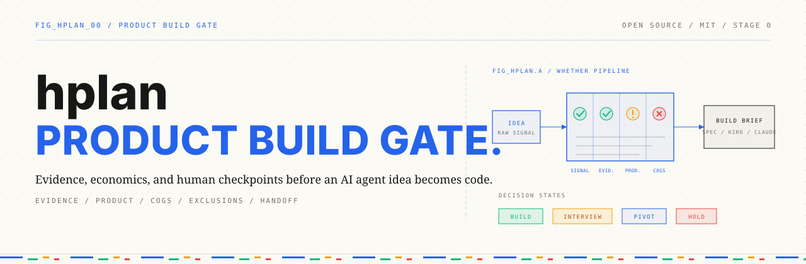
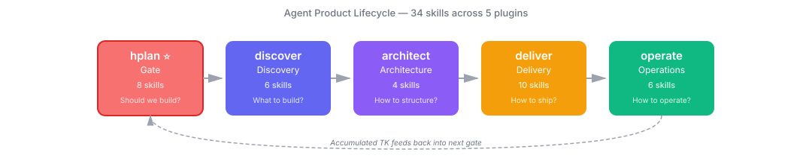

# hplan — The Product Build Gate for AI Agents

> **The 30-minute check that stops you from spending 6 months building the wrong AI product.**

> 🐎 **What `hplan` means — Harness Planning.**
> Like a horse's harness, hplan gives direction to the raw power of AI coding tools (Claude Code, Cursor, Lovable, etc.). The tools that *make* code are already strong enough. What's missing is *where to point them*. hplan is the 7-day discipline that forces you to answer market research, problem definition, and COGS *before* a single PRD line is written.

[](LICENSE)
[](#plugins--full-skill-list)
[](#the-agent-pm-journey--5-plugins)
[](CHANGELOG.md)
[](CONTRIBUTING.md)
[](README-ko.md)

> **v0.14.1** — hplan now ships as a complete **ADK (Agent Development Kit)**: **L1 Memory** (`CLAUDE.md` — 9 behavioral rules auto-loaded every session) · **L2 Skills** (34 PM disciplines, auto-invoked) · **L3 Hooks** (`hooks/` — SessionStart gate status · PreToolUse gate enforcement · PostToolUse secret scanner + **MD→HTML auto-renderer**) · **L4 Subagents** (8-role parallel team) · **L5 Plugins** (marketplace). One `git clone` + `bash scripts/install-hooks.sh` activates all 5 layers. v0.9.4–v0.14.1 history: see [CHANGELOG.md](CHANGELOG.md).

### 📺 99-second intro

https://github.com/kimsanguine/hplan/releases/download/v0.9.0-video-preview/v9-core-16x9.mp4

> _5-plugin lifecycle: hplan (gate) → discover → architect → deliver → operate. [v0.9.0-video-preview release](https://github.com/kimsanguine/hplan/releases/tag/v0.9.0-video-preview)._

## The Problem hplan Solves

You have an AI product idea. Cursor can prototype it in a weekend. Spec-Kit can spec it in an hour. Claude Code can ship a first version overnight.

**But should you build it?**

Every AI tool today is great at making things *fast*. None of them ask whether the thing should exist at all. So PMs and founders end up:

- 🪦 Building products customers don't actually want (waitlists and "I would use this" aren't evidence)
- 💸 Promising "unlimited AI" pricing that quietly loses money at scale (Replit went from $2M ARR to single-digit margins this way)
- 🔁 Re-pitching the same idea their team killed 3 months ago — and nobody remembers why
- 📋 Confidently shipping clones of established incumbents without realizing the territory is taken
- 🤷 Making "build" or "hold" decisions and never finding out which ones were actually right

**hplan is the 30-minute proof that your next 6 months will work.** It's the discipline of saying "let me check first" — encoded as deterministic tools, not just good intentions.

## How hplan Shows Up in Your Day

This is what changes once hplan is installed. You keep talking to Claude the way you already do — hplan steps in at the moments you most often slip up:

| You say to Claude | What hplan does |
|---|---|
| **"Let's build an AI assistant for our customers"** | hplan pauses and asks for the evidence. *"Which users currently spend 30+ min/week on this? Show me 3 real customer quotes."* If you can't, it stops you before any PRD work. |
| **"We'll charge $19/month for this AI feature"** | hplan runs the COGS calculation with real provider pricing, your expected usage, and a free-tier abuse scenario. Returns *p50 margin: 78%, p90: 41%, with free abuse: −12%*. Tells you exactly what needs to change. |
| **"This is similar to the idea Alex pitched last quarter"** | hplan checks the decision log. *"Yes — that idea was held on 2026-02-03 because [reasons]. The condition to revisit was 'enterprise customers explicitly ask'. Is that condition met now?"* |
| **"It's an AI tool that helps marketers write copy"** | hplan checks the exclusions registry first. *"This overlaps with prior exclusion ex-2026-04-17: established incumbents already cover this. Reopen trigger was 'serve a vertical with regulatory copy requirements'. Do you?"* |
| **"Spec it out so we can start building"** | hplan blocks the write until all three gates are green. If Evidence Gate said "interview" and COGS said "RED", the spec file simply does not get created. Filesystem-level block, not a polite warning. |
| **"Were my product decisions actually right?"** | hplan audits the last 6–12 months automatically. *"You held 8 ideas. 6 turned out to be correctly killed (validated). 2 someone else shipped successfully — those are 'false holds'. Here's what those 2 had in common."* |

The pattern: **you don't have to remember to invoke hplan.** Once installed, it triggers when you say things like "let's build", "we'll charge", "ship it", "spec it out".

## Who This Is For

- **Solo founders** deciding what to spend the next 6 months building
- **Product managers** who keep getting asked "can we build this with AI?" and want a structured way to answer
- **Teams using Spec-Kit / Cursor / Kiro / Claude Code** who want a *pre-spec filter* — not a replacement
- **Anyone** who has shipped something that looked good on paper and died in production, and wants the next idea to go differently

## WHETHER — The Question Every Other Tool Skips

> **"If AI coding tools have mastered HOW, hplan handles WHETHER. They're not used together — there's an order. hplan goes first."**

**HOW** asks: *"In what way should we build this?"*
**WHETHER** asks: *"Should we build this at all — yes or no?"*

WHETHER is bigger than WHY. WHY answers the reason ("why would users pay?"). WHETHER is the binary verdict that *contains* WHY — every gate in hplan answers a WHY question, and together they produce the WHETHER:

| Gate | WHY it answers | WHETHER it produces |
|------|---------------|---------------------|
| Evidence Rubric | Why do users actually have this problem? | Do we have sufficient proof to proceed? |
| Exclusions Check | Why did we kill this idea before? | Is this iteration meaningfully different? |
| COGS Sentinel | Why would this pricing work at scale? | Can the economics support a real business? |
| **All 3 combined** | — | **GO / HOLD / INVESTIGATE** |

Other tools handle **HOW** (Claude Code plugins → how to work with Claude Code), **WHERE** (GSD → where in the workflow). hplan handles **WHETHER** — the decision that comes before all other decisions.

### hplan's 3 Principles vs Opposing Assumptions

| hplan Principle | Opposing Assumption |
|----------------|---------------------|
| **Less conversation, more customer docs** — the more documentation you have on customers, market, and competitors, the more accurately LLMs assist | Having longer conversations with LLMs improves results |
| **Big tasks step by step** — don't stack unvalidated premises in context | Giving LLMs a large context at once leads to better understanding |
| **Validate first, build later** — writing a PRD without evidence is the start of technical debt | A quick prototype is how you validate |

<p align="center">
  
</p>

> 🆕 **New to Claude Code?** → [`deliver/agent-setup`](deliver/skills/agent-setup/SKILL.md) scans your project, auto-generates CLAUDE.md, and recommends the right hplan plugins. The fastest way to onboard.

## Under the Hood

For the technically curious, here's what makes hplan different from every other PM toolkit:

- 🧪 **Executable COGS sentinel** — p50 / p90 monthly margin is computed by a real Python sampler with provider pricing snapshots, not estimated by an LLM. Free-user abuse is modeled, not hand-waved.
- 📚 **Append-only exclusions registry** — every "Do Not Build" gets a JSONL entry with a `reopen_trigger`. New ideas auto-collision-check with Korean-aware fuzzy match.
- 📊 **Self-evaluating decision log** — every gate decision is logged with reasons; outcomes are back-filled later; an `audit` command surfaces hit rate, false holds, and missed builds. The only PM gate that measures its own accuracy.
- 🔌 **MCP server** — the same gate primitives are exposed as MCP tools, so Cursor / Windsurf / Kiro / Codex / Goose can call them, not just Claude Code.
- 🛑 **Claude Code PreToolUse hook** — blocks writes to `PRD.md` / `specs/*` / `.kiro/specs/*` until `harness/build-gate/checkpoint.json` shows `status: "approved"`. Gate enforcement at the filesystem level, not just in prompts.
- 🚚 **Multi-target handoff** — one brief JSON exports simultaneously to Spec-Kit `specs/NNN-slug/`, Kiro `.kiro/specs/`, GStack `/office-hours` brief, and Claude Code `AGENTS.md` + `CLAUDE.md`.

*Renamed from `AI_PM_Skills` in v0.5. v0.9 consolidates to a clean 5-plugin lifecycle: hplan (gate) → discover → architect → deliver → operate. Old URLs auto-redirect.*

---

## The Problem

In 2026, PMs are being asked to "build an agent" — but existing PM skills don't prepare you for that.

General PM skills teach you to **use AI as a tool** — write PRDs faster, generate OKRs, analyze competitors. But when you're **building agents as products**, the questions are fundamentally different:

- "What would it cost to run this agent at 1,000 users/day?"
- "How does an agent recover from hallucination?"
- "How do I orchestrate multiple agents together?"
- "How do I encode 3 months of operational judgment into the agent's instructions?"

This project turns those questions into **34 production-grade skills** across the full agent lifecycle.

---

## Quick Start (60 seconds)

For private course distribution, use the one-line installer:

```bash
bash <(curl -fsSL https://habix.ai/hplan/install.sh)
```

This installs the current private package to `~/hplan` and registers local Claude CLI aliases. See [`docs/private-distribution.md`](docs/private-distribution.md) for the Worker/R2 publishing flow.

```bash
# 1. Install the marketplace
/plugin marketplace add kimsanguine/hplan
/plugin install hplan@kimsanguine-hplan

# 2. Verify your install (hooks, gate_guard, exclusions registry)
/harness-doctor
# → [ PASS ] Hook 등록      gate_guard.py — PreToolUse에 등록됨
# → [ PASS ] Hook 실행      exit=2 (PRD.md 차단 정상 동작)
# → [ PASS ] Exclusions     유효, 0건

# 3. Run all 3 gates in one command — exclusions + evidence + COGS → verdict
/hplan "AI marketing copy generator"
# → [exclusions] COLLISION with ex-2026-04-17 (established incumbents)
# → reopen_trigger UNMET → HOLD

# 4. After the gate passes — run the lifecycle
/harness-discover "AI marketing copy generator"  # opportunity mapping → assumptions
/harness-plan "AI marketing copy generator"      # architecture → orchestration → memory → routing
/harness-build                                   # PRD → sprint → design → tracking
/harness-operate                                 # KPI → reliability → cost review
```

**Already past the gate?** Install by lifecycle stage:

```bash
/plugin install discover@kimsanguine-hplan   # Discover — opportunity trees, assumptions, cost sim, agent-gtm
/plugin install architect@kimsanguine-hplan  # Architect — orchestration, memory, moat, design-token
/plugin install deliver@kimsanguine-hplan    # Deliver — PRD, instructions, build tracking, UI/UX enforcement
/plugin install operate@kimsanguine-hplan    # Operate — KPI, reliability, portfolio, PM knowledge capture
```

---

## The Agent PM Journey — 5 Plugins

This isn't a random collection of skills. It's a **complete lifecycle** — the same path every agent PM walks. `hplan` is the gate that decides whether the thing should be built at all. Then four plugins cover the full journey from discovery to operation.

```
   Gate  →  Discover  →  Architect  →  Deliver  →  Operate
   hplan    discover      architect     deliver      operate
   8 skills  6 skills     4 skills      10 skills   6 skills   (= 34 total)

     ↑                                                   │
     └──── Operational insights feed back into gate ─────┘
```

| Plugin | The Question | Key Skills (currently available) |
|--------|-------------|------------|
| **Gate** ⭐ `hplan` | "Should we build this at all?" | brainstorm · evidence-rubric · interview-synthesis · exclusions · cogs-sentinel · ost · decision-log · handoff |
| **Discover** `discover` | "What agent should we build?" | opp-tree · assumptions · cost-sim · hitl · socratic-question · customer-reach |
| **Architect** `architect` | "How should we structure it?" | orchestration · memory-arch · design-token · strategy |
| **Deliver** `deliver` | "How to spec, build, and ship it?" | agent-setup · prd · build-loop · conductor · sprint · qa-checklist · respect · ui-validate · ask-team · ticket-bridge |
| **Operate** `operate` | "How to run and improve agents over time?" | metrics-design · reliability · pm-engine · incident · ops-review · portfolio |

### What makes hplan different from the other 4

Other plugins are **prompt-driven thinking** — LLM ponders, you decide.
`hplan` adds **deterministic measurement** — Python scripts calculate p50/p90 COGS margins, append-only registries persist exclusions and decisions across runs, an MCP server lets Cursor/Windsurf/Kiro/Codex call hplan primitives, and a PreToolUse hook blocks PRD/spec writes until the human approves the gate. It is paired with discover/architect/deliver/operate, not a replacement.

Each skill **auto-loads from natural language** — describe your task and the right skill fires. Skills also **route across plugins**: ops-review (operate) detects a cost spike → suggests orchestration `--pattern router` (architect) for model change → triggers cost-sim (discover) for re-simulation.

---

## Why This Is Different — 6 Things No Other Skillset Does

### ① Complete Agent Lifecycle, Not Random Tools

34 skills across 5 plugins cover the full agent product lifecycle (Gate → Discover → Architect → Deliver → Operate). This isn't "AI tools for PMs" — it's **a structured methodology for building agents as products**, from discovery to production operations.

### ② Two-Layer Architecture — Platform and Content Separation

We separate **how Claude finds skills** (Platform Layer — Skills 2.0 spec) from **what goes inside each skill** (Content Layer). The Content Layer defines the Trigger Gate (Use/Route/Boundary) pattern that prevents skill collisions, plus domain-specific context in each skill's `context/domain.md`. Result: **97.9% trigger accuracy** measured on v0.6 baseline (124 queries); v0.8 expands to 168 total queries (+44 for new 11 skills, re-measurement after API quota reset).

```
┌─ Platform Layer ──── Skills 2.0 Spec ──────────────────────┐
│  frontmatter · auto-invocation · subagent · hooks · evals   │
├─ Content Layer ──── hplan Pattern ──────────────────┤
│  Core Goal → Trigger Gate → Failure Handling                │
│  → Quality Gate → Examples · context/domain.md              │
└─────────────────────────────────────────────────────────────┘
```

### ③ Data Flywheel — PM Tacit Knowledge That Accumulates

learn is the moat. It structures your operational judgment into **TK (Tacit Knowledge) units**, then injects them into agent instructions. The more you use it, the smarter your agents get — and that knowledge **stays yours**.

```
PM judgment notes → /extract → TK-NNN structured units → PM-ENGINE-MEMORY.md
  → /tk-to-instruction → agent system prompt updated → repeat
```

This creates **switching cost**: competitors can copy the framework, but they can't copy your accumulated TK.

### ④ Eval-Driven ROI — Proof, Not Promises

Every skill is measured. 10 quality tests with 54 assertions prove what skills add vs base Claude. Result:

| | With Skill | Without Skill | Delta |
|---|-----------|--------------|-------|
| **Pass Rate** | **100%** | 88% | **+12%** |

`pm-framework` without skill drops to 40%. `cost-sim` with skill adds +46.6% output. This is **data-driven proof** that the skills work.

### ⑤ Good/Bad Examples for Data-Driven Improvement

Every skill includes `examples/good-01.md` and `examples/bad-01.md` — concrete right/wrong output pairs. Plus `references/test-cases.md` with edge case tables. These aren't decorative; they're **training signals** that make skill quality measurable and continuously improvable.

### ⑥ Skills 2.0 Full Spec + Instant Onboarding

Built on Claude Code's latest platform spec: auto-invocation, `context: fork`, `allowed-tools`, `model` field, dynamic `!command` injection, marketplace, and eval system. New users start with the [PM-ENGINE-MEMORY Starter Kit](operate/skills/pm-engine/examples/PM-ENGINE-MEMORY-STARTER.md) — 5 seed TK entries so the value is **immediate**, not "someday when I accumulate enough data."

### ⑦ Three Engineering Layers — The Stack Most AI Toolkits Miss

Most "AI for PMs" tools operate at a single layer: Prompt Engineering — better templates, faster output. hplan is built across three layers that must work together:

| Layer | What it does | hplan tools |
|-------|-------------|-------------|
| **Prompt Engineering** | Structured prompts that extract real signal — not opinion or LLM speculation | evidence-rubric · interview-synthesis · OST · cogs-sentinel |
| **Context Engineering** | *Garbage in, garbage out.* Customer documents, market data, and competitive context enter the system *before* any PRD — not inferred afterward. The exclusions registry and decision-log are institutional memory as permanent, structured context. | exclusions · decision-log · interview-synthesis |
| **Harness Engineering** | Deterministic guardrails enforced at the system level: Python scripts, append-only JSONL registries, a PreToolUse hook that blocks PRD writes at the filesystem. The discipline exists even when you'd rather skip it. | gate_guard.py · cogs_sentinel.py · exclusions_registry.py · MCP server |

> *Prompt Engineering improves HOW you ask. Context Engineering determines WHAT goes in. Harness Engineering enforces WHETHER you proceed.*

A perfect prompt with bad customer data produces confidently wrong conclusions. An excellent evidence rubric means nothing if a developer can bypass it and write the PRD anyway. All three layers are required — and in that order.

---

## Plugins — Full Skill List

<details>
<summary><strong>1. hplan ⭐</strong> — Should we build this at all? <code>(8 skills, 11 commands)</code></summary>

The gate that runs *before* discovery. Deterministic measurement (Python scripts, not LLM estimates), append-only memory (exclusions + decisions across runs), and a hook that blocks PRD/spec writes until a human approves.

| Skill | What it does | When to use |
|-------|-------------|-------------|
| `evidence-rubric` | Score idea against 100-point evidence rubric — ICP, recent painful event, workaround, repetition, economic pain, switching trigger, MVP narrowness, acquisition path | "Should we even start interviews on this idea?" |
| `interview-synthesis` | Import AI synthesis output (BuildBetter / Perspective / similar tools), force human strength + Push/Pull/Habit/Anxiety axes tagging, audit 5-of-3 strong-Push rule | "We have 5 customer call transcripts — is the pattern strong enough?" |
| `exclusions` | Append-only Do-Not-Build registry with reopen_trigger and Korean-aware fuzzy-match collision detection | "Same idea as last quarter? Was it killed?" |
| `cogs-sentinel` | Executable COGS gate — p50/p90 monthly margin via lognormal sampler, free-user abuse blend, GREEN/CONDITIONAL_GO/RED decision | "Will $19/mo actually make money at p90?" |
| `ost` | Generate Teresa Torres-style Opportunity Solution Tree as `docs/OPPORTUNITY_TREE.md` with Mermaid diagram | "Lock the opportunity → solution → experiment tree before any PRD" |
| `decision-log` | Append-only build/interview/pivot/hold log + 3–6 month self-eval audit (hit_rate, false_holds, missed_builds) | "Were my product decisions 6 months ago actually right?" |
| `handoff` | Multi-target Build Gate brief → Spec-Kit / Kiro / GStack / Claude Code in one command | "Ready to start building — export the spec to my coding agent" |
| `brainstorm` | Develop a vague idea into a product concept — structured question flow, tradeoff exploration, 2-3 approach proposals | "I want to crystallize a fuzzy idea before writing a PRD" |

**Commands (12 total — 11 in `hplan/` + `/prd` from deliver):** `/hplan` ⭐ · `/prd` · `/evidence-rubric` · `/cogs-sentinel` · `/harness-discover` · `/harness-plan` · `/harness-build` · `/harness-operate` · `/harness-exclude` · `/harness-handoff` · `/harness-verify` · `/harness-doctor`

**Cross-cutting assets:** MCP server (`hplan_mcp/`) for Cursor / Windsurf / Kiro / Codex / Goose · PreToolUse hook (`hooks/gate_guard.py`) · 4 role-locked reviewer agents (`agents/`)
</details>

<details>
<summary><strong>2. discover</strong> — What agent to build? <code>(6 skills)</code></summary>

> ✅ **All 6 are callable:** `opp-tree` · `assumptions` · `cost-sim` · `hitl` · `socratic-question` · `customer-reach`
> `build-or-buy` and `agent-gtm` are **roadmap** — not shipped.

| Skill | What it does | When to use |
|-------|-------------|-------------|
| `opp-tree` | Build an opportunity tree scored by repeat frequency, automation fit, and judgment dependency | "We have 10 automation candidates — which one first?" |
| `assumptions` | Extract riskiest assumptions across 4 axes (Value/Feasibility/Reliability/Ethics) and design 2-day validation experiments | "What's the biggest risk before we start building?" |
| `hitl` | Set automation levels (1-5) and escalation triggers via reversibility × error-impact matrix | "Can the agent decide refunds, or must a human approve?" |
| `cost-sim` | Simulate monthly costs at 1→10→100→1,000 users by model pricing × call patterns | "Sonnet at 500 calls/day — what's the monthly bill?" |
| `socratic-question` | Interrogate your assumptions with Socratic questioning before committing to any idea — surfaces hidden risks and untested premises | "Challenge my thinking before I write the PRD" |
| `customer-reach` | Find + contact interview candidates and design interview questions before the evidence gate. `--mode plan\|linkedin\|community\|survey\|interview-questions` | "Who do I talk to, and what do I say, to fill pain.md?" |

**Commands:** `/harness-discover`
</details>

<details>
<summary><strong>3. architect</strong> — How to architect it? <code>(4 skills)</code></summary>

> ✅ **All 4 are callable:** `orchestration` · `memory-arch` · `design-token` · `strategy`
> `biz-model`, `moat`, `growth-loop` are consolidated into `strategy` (`--focus`). Router-style model routing is now a mode of `orchestration` (`--pattern router`).

| Skill | What it does | When to use |
|-------|-------------|-------------|
| `orchestration` | Compare Sequential/Parallel/Router/Hierarchical (Prometheus→Atlas→Worker) patterns by latency, error rate, and cost. `--pattern router` auto-routes tasks to T1-T4 models by complexity + fallback chains for 40-80% cost reduction | "Should my doc pipeline run serial or parallel?" / "I need 5 agents — who controls whom?" / "Simple FAQ → Haiku, complex analysis → Opus — auto?" |
| `memory-arch` | Design Working/Episodic/Semantic/Procedural memory layers + token-budget-aware retrieval | "How does today's session recall yesterday's context?" |
| `strategy` | Unified strategy design — business model canvas, competitive moat analysis (data flywheel, lock-in, network effects, switching costs), and growth-loop design. `--focus biz-model\|moat\|growth-loop\|all` | "A competitor ships a GPT clone — what's our defense and pricing?" |
| `design-token` | Phase A: filter reference sites → DESIGN_BRIEF.md. Phase B: DESIGN_BRIEF.md → semantic CSS tokens (tokens.md) + DESIGN.md with breakpoint spec | "Set UI direction after ICP confirmation, then generate tokens" |

**Commands:** `/harness-plan`
</details>

<details>
<summary><strong>4. deliver</strong> — How to spec, build, and ship it? <code>(10 skills)</code></summary>

> ✅ **All 10 are callable:** `agent-setup` · `prd` · `build-loop` · `conductor` · `sprint` · `qa-checklist` · `respect` · `ui-validate` · `ask-team` · `ticket-bridge`
> Absorbed in v0.14.1: delivery-plan + track → `sprint` · roadmap → `prd --mode roadmap` · stakeholder-review → `ask-team --mode review` · stakeholder-update → operate `ops-review`. Earlier roadmap names (agent-instructions, ctx-budget, stakeholder-map, agent-plan-review, harness-design, parallel-team) are not shipped as standalone skills.

| Skill | What it does | When to use |
|-------|-------------|-------------|
| `agent-setup` ⭐ | Scan project structure → auto-generate CLAUDE.md → recommend matching hplan plugins | "New project — set up Claude Code context" |
| `prd` | **Unified 15-section PRD** — People/Problem/Decisions + Agent/Execution Spec + Metrics/Hypotheses/Failure + §15 QA Pool. `--mode roadmap` turns gate verdicts + sprint estimates into a prioritized timeline/milestone view | "Write a PRD for a solo-lawyer Korean case-law RAG agent" / "Turn our gate verdicts and sprint estimates into a shareable roadmap" |
| `build-loop` | Autonomous build-loop orchestration with checkpoint gates | "Run the full build loop unattended" |
| `conductor` | Per-task fresh-subagent dispatch with a 2-stage gate (spec → quality) repeated each task — sequential task loop after `harness-plan` approval (vs `parallel-team`'s role parallelism) | "Run the implementation loop task-by-task with gates between each" |
| `sprint` | Sprint plan-execute-track unified (absorbed delivery-plan + track) — PRD → WBS, predicted.json init, probe/detect/report/checkpoint. `--step plan\|init\|status\|retro\|codebase-status` | "Lock predicted scope, then track progress and auto-detect when I'm stuck" |
| `qa-checklist` | Parse docs/PRD.md → auto-generate harness/QA_CHECKLIST.md, classifying test cases critical/major/minor by ICP + failure scenarios with device/environment links | "Turn PRD acceptance criteria into a graded QA checklist before the quality gate" |
| `respect` | Brief (`--mode brief`): interview-driven RESPECT.md before any UI code. Checkpoint (`--mode checkpoint`): pre-ship α/β/γ gate enforcement | "Capture user-respect intent before coding" / "Ship-time user-respect gate" |
| `ui-validate` | Playwright 375/768/1440px viewport gate + DOM saliency + WCAG AA + design-system drift detection | "Do not declare build complete until all viewports pass per DESIGN.md spec" |
| `ask-team` | Structured question routing to the right stakeholder or agent role — prevents wrong-audience decisions. `--mode review` runs a multi-stakeholder PRD review — assigns reviewers, collects comments, and keeps a signoff audit trail | "Who should I ask about this trade-off?" / "Run a PRD signoff review with reviewer assignment and an audit trail" |
| `ticket-bridge` | Convert PRD decisions and gate outputs into trackable tickets (Linear / Jira / GitHub Issues) | "Turn the gate verdict into sprint tickets automatically" |

**Commands:** `/harness-build`
</details>

<details>
<summary><strong>5. operate</strong> — How to run and improve agents over time? <code>(6 skills)</code></summary>

> ✅ **All 6 are callable:** `metrics-design` · `reliability` · `pm-engine` · `incident` · `ops-review` · `portfolio`
> v0.14.1 consolidation: `agent-portfolio` + `portfolio-report` → `portfolio` · `burn-rate` → `ops-review` (cost mode) · `stakeholder-update` absorbed into `ops-review`. Earlier roadmap names (premortem, agent-ab-test, cohort, pm-decision, cross-team-routing) are not shipped.

| Skill | What it does | When to use |
|-------|-------------|-------------|
| `metrics-design` | North Star selection + KPI derivation + dual-axis OKRs (Business Impact + Operational Health). `--step north-star\|kpi\|okr\|all` | "Team doesn't know which KPI matters most" / "Is 95% accuracy enough, or do I need cost metrics?" |
| `reliability` | Quantify P95/P99 worst cases + design safeguards + set SLA tiers | "3 out of 100 responses hallucinate — acceptable?" |
| `pm-engine` | Agents dynamically query TK knowledge graph at runtime + auto-extract 1 TK/day + auto-update instructions. `--mode extract` converts implicit judgment into TK-NNN units | "I want my agents to leverage my operational know-how automatically" / "3 years of ops experience stuck in my head" |
| `incident` | Detect silent failures + triage + contain blast radius + 5 Whys | "Agent silent for 30 min — no alerts fired" |
| `ops-review` | Weekly/monthly operational review + stakeholder updates — token-cost tracking, weekly rollup, real LLM cost vs COGS check, anomaly detection. `--mode cost\|weekly\|full\|exec-summary\|weekly-update\|partner-brief\|confluence-export` (absorbed stakeholder-update) | "Monday morning — what changed across my fleet?" / "Token costs jumped 40% — what caused it?" / "Send an exec 1-pager / weekly team update / partner brief / Confluence export" |
| `portfolio` | T1~T5 tiering by Reach × Reliability × Strategic value + weighted 5-axis scorecard comparison | "I run 5+ agents — which one deserves next quarter's investment?" |

**Commands:** `/harness-operate`

> Start with the [PM-ENGINE-MEMORY Starter Kit](operate/skills/pm-engine/examples/PM-ENGINE-MEMORY-STARTER.md) — 5 seed TK entries to get going immediately.
</details>

---

## Installation

### Option 1: GitHub Marketplace (Recommended)

```bash
/plugin marketplace add kimsanguine/hplan
/plugin install hplan@kimsanguine-hplan    # or discover · architect · deliver · operate
```

### Option 2: Clone Locally (Full ADK Stack)

```bash
git clone https://github.com/kimsanguine/hplan.git
cd hplan

# Install all 5 ADK layers at once:
bash scripts/install-hooks.sh   # L3 hooks + git pre-commit

claude --plugin-dir ./hplan     # L2 Skills — pick what you need (hplan, discover, architect, deliver, operate)
```

**Not sure which AI product to commit to?** → Start with `hplan` — evidence gate first.
**First time with Claude Code?** → Run `deliver/agent-setup` — it scans your project and recommends the right plugins.
**Already past the gate?** → Pick by lifecycle stage (discover → architect → deliver → operate).

### ADK 5-Layer Architecture

hplan ships as a complete **Agent Development Kit** — five reinforcing layers that activate automatically:

| Layer | What | How it activates |
|-------|------|-----------------|
| **L1 Memory** | `CLAUDE.md` — 9 behavioral rules + hplan gate policy | Loaded by Claude Code at session start, every time |
| **L2 Skills** | 34 PM discipline skills across 5 plugins | Auto-invoked when you describe a task in natural language |
| **L3 Hooks** | `hooks/` — PreToolUse · PostToolUse · SessionStart | `scripts/install-hooks.sh` registers to `.claude/settings.json` |
| **L4 Subagents** | 8-role parallel team (designer · engineer · critic · security…) | Dispatched by `deliver/skills/parallel-team` |
| **L5 Plugins** | Marketplace distribution (`/plugin install`) | Claude Code plugin registry |

**What each hook does:**

| Hook | Trigger | Action |
|------|---------|--------|
| `SessionStart.sh` | Every new Claude session | Displays Build Gate status + Signal Gate doc inventory |
| `PreToolUse.sh` | Before every Write / Edit | Blocks PRD/ARCHITECTURE writes without approved checkpoint |
| `PostToolUse.sh` | After every Write / Edit | Warns if API keys / secrets appear in written content |

**After `scripts/install-hooks.sh`**, run `/harness-doctor` to verify all 5 layers are wired correctly.

### Option 3: Enterprise / Team Rollout

For organizations where individual `git clone` is not viable (IT approval required, shared tooling policy, SSO environments):

**Step 1 — Fork or mirror to your internal Git host (GitLab / Bitbucket / GitHub Enterprise):**
```bash
# GitLab mirror example
git clone --mirror https://github.com/kimsanguine/hplan.git
cd hplan.git
git remote set-url --push origin https://your-gitlab.example.com/yourteam/hplan.git
git push --mirror
```

**Step 2 — Install from internal mirror per developer:**
```bash
git clone https://your-gitlab.example.com/yourteam/hplan.git ~/hplan
cd ~/hplan
bash scripts/install-hooks.sh
```

**Step 3 — Distribute shared team config (optional):**
```bash
# Commit a shared profile to your internal mirror
cp -r profiles/_template profiles/your-team/
# Edit profiles/your-team/*.yaml with shared settings
# Commit to your internal repo — do NOT push to public
```

**What IT needs to approve:** `git clone` from your internal mirror, `bash scripts/install-hooks.sh` (modifies `~/.claude/settings.json`), Python 3.9+ for gate scripts.

> **Information security note:** hplan writes signoff records and PRD review logs to `harness/` inside your local project directory — not to any external service. If your team uses a private Git host, all artifacts stay inside your network perimeter.

### Information Security

hplan is designed to operate within your organization's existing security perimeter:

| Concern | hplan behavior |
|---|---|
| **Where PRD and signoff data lives** | `harness/` inside your local repo. No cloud sync unless you push to your own Git remote. |
| **External API calls** | Only when you explicitly use `ask-team --mode review` (Gmail draft) or `ticket-bridge --system jira`. Both require user confirmation before any write. |
| **Confluence / internal wikis** | `ops-review --mode confluence-export` outputs a Confluence-formatted `.md` file for manual upload — no Confluence API call, no credentials required. |
| **GitHub public repo risk** | If your project repo is public, keep `harness/` in `.gitignore`. The `profiles/` directory is gitignored by default. |
| **Role-based access** | Use your Git host's branch protection and access controls. hplan does not manage permissions — it defers to your existing IAM. |

For regulated environments (financial services, healthcare, government), the recommended pattern is: internal Git mirror + `harness/` gitignored + manual export to Confluence/SharePoint for signoff records.

### Other AI Tools

| Tool | Skills | Commands | How to use |
|------|:------:|:--------:|-----------|
| **Gemini CLI** | ✅ | ❌ | Copy to `.gemini/skills/` |
| **Cursor** | ✅ | ❌ | Copy to `.cursor/skills/` |
| **Codex CLI** | ✅ | ❌ | Copy to `.codex/skills/` |
| **Kiro** | ✅ | ❌ | Copy to `.kiro/skills/` |

---

<details>
<summary><strong>📐 Architecture Deep-Dive</strong> — Two Layers, Skills 2.0, Trigger Gate, Commands</summary>

### Auto-Invocation

You don't call skills by name. Describe your task in natural language, and Claude matches it against each SKILL.md's `description` field to auto-load the best fit. Trigger accuracy: **97.9%** measured on v0.6 baseline (124 queries); v0.8 expands to 168 total queries (+44 for new 11 skills, re-measurement after API quota reset).

### Cross-Plugin Routing

The Trigger Gate's "Route" field enables routing between plugins:

| From | Trigger Condition | Route To |
|------|------------------|----------|
| `opp-tree` | "Validate assumptions for top opportunity" | `assumptions` |
| `reliability` | "Need model routing change" | `orchestration --pattern router` |
| `prd` | "Need instruction design" | `architect/strategy` |
| `pm-engine --mode extract` | "Convert implicit judgment to TK units" | `pm-engine` |

### Command Chaining

> ℹ️ All chain entries below reference shipped skills. Currently callable slash commands: `/hplan` · `/prd` · `/evidence-rubric` · `/cogs-sentinel` · `/harness-*` (8 harness commands; 12 total).

| Command | Chained Skills | Plugin |
|---------|---------------|--------|
| `/hplan` ⭐ | exclusions → evidence-rubric → cogs-sentinel → verdict | hplan |
| `/harness-discover` | opp-tree → assumptions → hitl | discover |
| `/harness-plan` | orchestration → memory-arch → design-token | architect |
| `/harness-build` | prd → qa-checklist → respect | deliver |
| `/harness-operate` | metrics-design → reliability → ops-review · pm-engine | operate |

### Skills 1.0 vs Skills 2.0

| Feature | 1.0 (2025) | 2.0 (2026) | hplan |
|---------|-----------|-----------|-------------|
| Auto-invocation | ❌ | ✅ | ✅ 97.9% |
| Subagent (`context: fork`) | ❌ | ✅ | ✅ 5 skills |
| Tool restriction | ❌ | ✅ | ✅ orchestration |
| Marketplace + Evals | ❌ | ✅ | ✅ Full |
| Dynamic injection | ❌ | ✅ | ✅ 5 skills |
| Hooks | ❌ | ✅ | ⚠️ Spec-ready |

> ⚠️ `hooks` have a known issue ([#17688](https://github.com/anthropics/claude-code/issues/17688)). Fallback `validate_*.sh` scripts available in `references/`.

### File Structure

```
hplan/                # repo root
├── hplan/            # Gate ⭐ (8 skills, 11 commands) — Product Build Gate
├── discover/           # Discovery (6 skills)
├── architect/            # Architecture (4 skills)
├── deliver/            # Deliver (10 skills) — spec + track + UI enforcement
├── operate/            # Operate (6 skills) — KPI, reliability, PM knowledge, portfolio
│   └── evals/        # Quality + trigger evals
├── docs/images/      # Diagrams
├── validate_plugins.py
└── CONTRIBUTING.md
```

### Skill Anatomy — What's Inside Each Skill

Every skill follows a consistent internal structure. This isn't just Skills 2.0 spec compliance — it's a **content architecture** designed for measurable quality and continuous improvement:

```
discover/skills/opp-tree/           ← example skill
├── SKILL.md                      ← Core: frontmatter (name, description,
│                                    argument-hint, allowed-tools) +
│                                    Trigger Gate (Use/Route/Boundary) +
│                                    Failure Handling + Quality Gate
├── context/
│   └── domain.md                 ← Domain knowledge injected at runtime
│                                    (e.g., agent economics, industry benchmarks)
├── examples/
│   ├── good-01.md                ← ✅ Reference output — "this is what great looks like"
│   └── bad-01.md                 ← ❌ Anti-pattern — "this is what to avoid and why"
└── references/
    ├── test-cases.md             ← Edge cases, boundary conditions, eval criteria
    └── troubleshooting.md        ← Common failures + recovery patterns
```

**Why this matters:**

| Component | Purpose | Impact |
|-----------|---------|--------|
| `SKILL.md` Trigger Gate | Use/Route/Boundary → prevents wrong skill from firing | 97.9% trigger accuracy |
| `context/domain.md` | Domain expertise Claude doesn't have natively | +12~46% output quality |
| `examples/good-01.md` | Concrete "gold standard" output | Anchors Claude's generation |
| `examples/bad-01.md` | Explicit anti-patterns with explanations | Prevents common failures |
| `references/test-cases.md` | Edge cases + assertions | Powers eval system (54 assertions) |

This pattern repeats across all 34 skills — **200+ supporting files** that make each skill measurable, testable, and improvable.

</details>

<details>
<summary>📐 Plugin Lifecycle Diagram</summary>
<p align="center">
  
</p>
</details>

---

## Contributing

See [CONTRIBUTING.md](CONTRIBUTING.md) for guidelines. New skills, improvements, and translations (EN↔KO) are all welcome.

---

## Author

**Sanguine Kim** — 20-year PM veteran, AI Agent Builder & Educator

Built and scaled AI Dubbing and AI Avatar products, then led Agentic AI product development. Currently exploring the path of AI Agent PM educator — helping PMs navigate the shift from "using AI" to "building agents as products."

📬 **For training, consulting, or workshop inquiries:** kimsanguine@gmail.com

If you're using this project for corporate training or educational content, I'd appreciate a quick note. Customized consulting and co-teaching are welcome.

- References: Teresa Torres (*Continuous Discovery Habits*), Anthropic ("Building Effective Agents"), Steve Yegge (Gas Town parallel agent design), Byeonghyeok Kwak (MCP-Skills hierarchy), Michael Polanyi (*The Tacit Dimension*)

---

## Related

| Repo | What | Link |
|------|------|------|
| **AI_PM** | Claude Code guide for PMs — learn the why and how | [github.com/kimsanguine/AI_PM](https://github.com/kimsanguine/AI_PM) |
| **hplan** | Ready-to-use agent skillset — the tools *(this repo)* | [github.com/kimsanguine/hplan](https://github.com/kimsanguine/hplan) |

> **AI_PM** teaches the thinking. **hplan** gives you the tools.

---

## License

MIT — [LICENSE](LICENSE)
