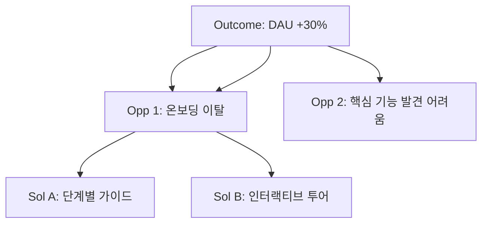
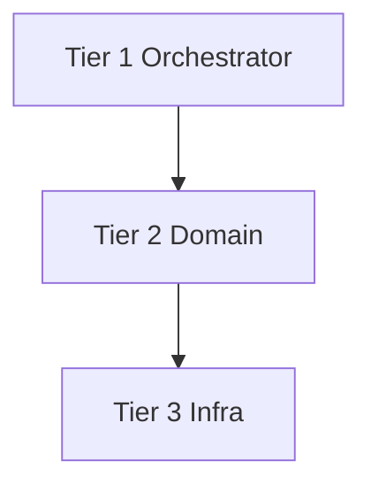

# hplan MD→HTML Auto-Renderer Implementation Plan

> **For agentic workers:** REQUIRED SUB-SKILL: Use superpowers:subagent-driven-development (recommended) or superpowers:executing-plans to implement this plan task-by-task. Steps use checkbox (`- [ ]`) syntax for tracking.

**Goal:** hplan 커맨드가 `.md`를 Write할 때 PostToolUse 훅이 자동으로 같은 위치에 `.html`을 생성한다. 10개 전용 템플릿 + generic 변환으로 게이트 판정·증거·추적·디자인 문서를 브라우저에서 즉시 열 수 있다.

**Architecture:** PostToolUse.sh가 Write 이벤트에서 `md_renderer.py`를 호출한다. Python이 경로 패턴으로 템플릿을 선택하고 MD를 파싱해 JSON dict를 만들어 `__DATA_JSON__` 플레이스홀더를 치환한다. 실제 Chart.js/Mermaid 렌더링은 브라우저 JavaScript가 담당한다.

**Tech Stack:** Python 3 stdlib only (re, json, pathlib), Tailwind CSS CDN, Chart.js 4 CDN, Mermaid 11 CDN, pytest

---

## File Map

```
hplan/
├── scripts/
│   ├── md_renderer.py                    [NEW] 핵심 변환 엔진
│   └── tests/
│       ├── fixtures/
│       │   ├── evidence_gate.md          [NEW] 파서 테스트 fixture
│       │   ├── cogs_sentinel.md          [NEW]
│       │   ├── gate_state.md             [NEW]
│       │   ├── pain_board.md             [NEW]
│       │   ├── ost_viewer.md             [NEW]
│       │   ├── market_intel.md           [NEW]
│       │   ├── architecture_blueprint.md [NEW]
│       │   ├── sprint_tracker.md         [NEW]
│       │   ├── prd_reader.md             [NEW]
│       │   └── design_system.md          [NEW]
│       ├── test_renderer_core.py         [NEW] 엔진 + 경로 매핑
│       ├── test_parser_evidence_gate.py  [NEW]
│       ├── test_parser_cogs_sentinel.py  [NEW]
│       ├── test_parser_gate_state.py     [NEW]
│       ├── test_parser_pain_board.py     [NEW]
│       ├── test_parser_ost_viewer.py     [NEW]
│       ├── test_parser_market_intel.py   [NEW]
│       ├── test_parser_architecture.py   [NEW]
│       ├── test_parser_sprint_tracker.py [NEW]
│       ├── test_parser_prd_reader.py     [NEW]
│       └── test_parser_design_system.py  [NEW]
├── templates/
│   ├── _base.html                        [NEW] 스캐폴딩 레퍼런스
│   ├── generic.html                      [NEW]
│   ├── evidence-gate.html                [NEW]
│   ├── cogs-sentinel.html                [NEW]
│   ├── gate-state.html                   [NEW]
│   ├── pain-board.html                   [NEW]
│   ├── ost-viewer.html                   [NEW]
│   ├── market-intel.html                 [NEW]
│   ├── architecture-blueprint.html       [NEW]
│   ├── sprint-tracker.html               [NEW]
│   ├── prd-reader.html                   [NEW]
│   └── design-system.html               [NEW]
└── hooks/ (hplan 플러그인 외부, 레포 루트 위치)
hooks/
└── PostToolUse.sh                        [MODIFY] MD→HTML 렌더링 블록 추가
```

**HTML 생성 위치 규칙:** `harness/evidence/report.md` → `harness/evidence/report.html` (MD 옆에 바로 생성, 별도 폴더 없음)

---

## 전제조건

```bash
git clone https://github.com/kimsanguine/hplan.git
cd hplan
python3 -m pytest --version   # pytest 설치 확인
# 없으면: pip install pytest
```

---

## Task 1: Core Engine — md_renderer.py

**Files:**
- Create: `hplan/scripts/md_renderer.py`
- Create: `hplan/scripts/tests/test_renderer_core.py`

- [ ] **Step 1-1: 테스트 파일 생성 (실패 확인용)**

`hplan/scripts/tests/test_renderer_core.py`:

```python
import sys
from pathlib import Path
sys.path.insert(0, str(Path(__file__).parent.parent))

from md_renderer import select_template, should_exclude


class TestExcludePatterns:
    def test_claude_md_excluded(self):
        assert should_exclude("CLAUDE.md") is True

    def test_readme_excluded(self):
        assert should_exclude("README.md") is True

    def test_plugin_md_excluded(self):
        assert should_exclude("hplan/PLUGIN.md") is True

    def test_skill_md_excluded(self):
        assert should_exclude("hplan/skills/evidence-rubric/SKILL.md") is True

    def test_references_excluded(self):
        assert should_exclude("hplan/references/market-research.md") is True

    def test_examples_excluded(self):
        assert should_exclude("hplan/skills/cogs-sentinel/examples/good-01.md") is True

    def test_harness_md_not_excluded(self):
        assert should_exclude("harness/evidence/report.md") is False

    def test_docs_md_not_excluded(self):
        assert should_exclude("docs/PRD.md") is False


class TestTemplateSelection:
    def test_evidence_report(self):
        assert select_template("harness/evidence/report.md") == "evidence-gate"

    def test_cogs_report(self):
        assert select_template("harness/build-gate/cogs_report.md") == "cogs-sentinel"

    def test_state_md(self):
        assert select_template("harness/STATE.md") == "gate-state"

    def test_pain_md(self):
        assert select_template("harness/pain.md") == "pain-board"

    def test_opportunity_tree(self):
        assert select_template("docs/OPPORTUNITY_TREE.md") == "ost-viewer"

    def test_competitors_md(self):
        assert select_template("harness/competitors.md") == "market-intel"

    def test_architecture_md(self):
        assert select_template("harness/ARCHITECTURE.md") == "architecture-blueprint"

    def test_progress_md(self):
        assert select_template("harness/PROGRESS.md") == "sprint-tracker"

    def test_prd_md(self):
        assert select_template("docs/PRD.md") == "prd-reader"

    def test_design_md(self):
        assert select_template("docs/DESIGN.md") == "design-system"

    def test_respect_md(self):
        assert select_template(".design/RESPECT.md") == "design-system"

    def test_other_harness_md_gets_generic(self):
        assert select_template("harness/market.md") == "generic"

    def test_other_docs_md_gets_generic(self):
        assert select_template("docs/DESIGN_SYSTEM.md") == "generic"

    def test_specs_md_gets_generic(self):
        assert select_template("specs/001-auth/spec.md") == "generic"

    def test_unrelated_path_returns_none(self):
        assert select_template("src/main.py") is None
```

- [ ] **Step 1-2: 테스트 실패 확인**

```bash
cd hplan
python3 -m pytest hplan/scripts/tests/test_renderer_core.py -v 2>&1 | head -20
```

예상 출력: `ModuleNotFoundError: No module named 'md_renderer'`

- [ ] **Step 1-3: md_renderer.py 구현**

`hplan/scripts/md_renderer.py`:

```python
#!/usr/bin/env python3
"""
hplan MD → HTML 자동 렌더러
PostToolUse.sh에서 호출됨. 실패 시 항상 조용히 exit 0.
사용법: python3 md_renderer.py <file_path>
"""

import sys
import re
import json
from pathlib import Path

# ── 경로 상수 ─────────────────────────────────────────────
TEMPLATE_DIR = Path(__file__).parent.parent / "templates"

# ── 제외 패턴 ─────────────────────────────────────────────
_EXCLUDE_PATTERNS = [
    r"(?:^|/)CLAUDE\.md$",
    r"(?:^|/)README\.md$",
    r"(?:^|/)PLUGIN\.md$",
    r"(?:^|/)SKILL\.md$",
    r"(?:^|/)CHANGELOG\.md$",
    r"(?:^|/)CONTRIBUTING\.md$",
    r"(?:^|/)GUIDE.*\.md$",
    r"/references/.*\.md$",
    r"/examples/.*\.md$",
]

# ── 경로→템플릿 매핑 (순서 중요 — 위에서 먼저 매칭) ────────
_TEMPLATE_MAP = [
    (r"harness/evidence/report\.md$",           "evidence-gate"),
    (r"harness/build-gate/cogs_report\.md$",    "cogs-sentinel"),
    (r"harness/STATE\.md$",                     "gate-state"),
    (r"harness/pain\.md$",                      "pain-board"),
    (r"docs/OPPORTUNITY_TREE\.md$",             "ost-viewer"),
    (r"harness/competitors\.md$",               "market-intel"),
    (r"harness/ARCHITECTURE\.md$",              "architecture-blueprint"),
    (r"harness/PROGRESS\.md$",                  "sprint-tracker"),
    (r"docs/PRD\.md$",                          "prd-reader"),
    (r"(?:docs/DESIGN\.md|\.design/RESPECT\.md)$", "design-system"),
    # generic fallback — harness, docs, specs 하위 나머지
    (r"(?:harness|docs|specs)/.*\.md$",         "generic"),
]


def should_exclude(file_path: str) -> bool:
    """True이면 변환하지 않는다."""
    for pattern in _EXCLUDE_PATTERNS:
        if re.search(pattern, file_path):
            return True
    return False


def select_template(file_path: str) -> str | None:
    """경로 패턴 매칭으로 템플릿 이름 반환. 매칭 없으면 None."""
    for pattern, template_name in _TEMPLATE_MAP:
        if re.search(pattern, file_path):
            return template_name
    return None


def _load_template(template_name: str) -> str | None:
    """템플릿 HTML 파일을 읽는다. 없으면 None."""
    template_path = TEMPLATE_DIR / f"{template_name}.html"
    if not template_path.exists():
        # 전용 템플릿 없으면 generic으로 폴백
        if template_name != "generic":
            return _load_template("generic")
        return None
    return template_path.read_text(encoding="utf-8")


def render(template_name: str, data: dict) -> str | None:
    """템플릿에 data dict를 __DATA_JSON__ 자리에 주입한 HTML 반환."""
    html = _load_template(template_name)
    if html is None:
        return None
    json_str = json.dumps(data, ensure_ascii=False, indent=None)
    return html.replace("__DATA_JSON__", json_str)


def main() -> None:
    if len(sys.argv) < 2:
        sys.exit(0)

    file_path = sys.argv[1]

    if should_exclude(file_path):
        sys.exit(0)

    template_name = select_template(file_path)
    if template_name is None:
        sys.exit(0)

    try:
        md_path = Path(file_path)
        if not md_path.exists():
            sys.exit(0)

        md_content = md_path.read_text(encoding="utf-8")

        # 파서는 Task 2~14에서 추가됨. 지금은 generic 데이터로 처리.
        from parsers import parse  # noqa: E402 (Task 2에서 생성)
        data = parse(md_content, template_name)

        html = render(template_name, data)
        if html is None:
            sys.exit(0)

        output_path = md_path.with_suffix(".html")
        output_path.write_text(html, encoding="utf-8")

    except Exception:
        pass  # 실패 시 조용히 종료 — Claude Code 흐름 비차단

    sys.exit(0)


if __name__ == "__main__":
    main()
```

- [ ] **Step 1-4: 테스트 통과 확인**

```bash
python3 -m pytest hplan/scripts/tests/test_renderer_core.py -v
```

예상 출력: `18 passed`

- [ ] **Step 1-5: 커밋**

```bash
git add hplan/scripts/md_renderer.py hplan/scripts/tests/test_renderer_core.py
git commit -m "feat(renderer): add core engine — path matching and template selection"
```

---

## Task 2: Generic Parser + _base.html + generic.html

**Files:**
- Create: `hplan/scripts/parsers/__init__.py`
- Create: `hplan/scripts/parsers/generic.py`
- Create: `hplan/templates/_base.html`
- Create: `hplan/templates/generic.html`

- [ ] **Step 2-1: generic 파서 테스트 작성**

`hplan/scripts/tests/test_renderer_core.py`에 추가 (파일 맨 아래):

```python
from parsers import parse as parse_md


class TestGenericParser:
    def test_extracts_title_from_h1(self):
        md = "# My Document\n\nSome content here."
        data = parse_md(md, "generic")
        assert data["title"] == "My Document"

    def test_extracts_title_from_frontmatter(self):
        md = "---\ntitle: Test Title\n---\n# Ignored H1"
        data = parse_md(md, "generic")
        assert data["title"] == "Test Title"

    def test_extracts_headings(self):
        md = "# Title\n## Section A\n### Sub\n## Section B"
        data = parse_md(md, "generic")
        assert "Section A" in [h["text"] for h in data["headings"]]
        assert "Section B" in [h["text"] for h in data["headings"]]

    def test_detects_mermaid_blocks(self):
        md = "```mermaid\nflowchart LR\nA --> B\n```"
        data = parse_md(md, "generic")
        assert data["has_mermaid"] is True

    def test_no_mermaid_when_absent(self):
        md = "# Title\n\nPlain text."
        data = parse_md(md, "generic")
        assert data["has_mermaid"] is False

    def test_extracts_body_html_safe(self):
        md = "# Title\n\nContent with **bold** text."
        data = parse_md(md, "generic")
        assert "Content with" in data["body_md"]

    def test_empty_md_returns_safe_defaults(self):
        data = parse_md("", "generic")
        assert data["title"] == "Untitled"
        assert data["headings"] == []
        assert data["has_mermaid"] is False
```

- [ ] **Step 2-2: 테스트 실패 확인**

```bash
python3 -m pytest hplan/scripts/tests/test_renderer_core.py::TestGenericParser -v
```

예상 출력: `ModuleNotFoundError: No module named 'parsers'`

- [ ] **Step 2-3: parsers 패키지 생성**

`hplan/scripts/parsers/__init__.py`:

```python
from .generic import parse_generic
from .evidence_gate import parse_evidence_gate
from .cogs_sentinel import parse_cogs_sentinel
from .gate_state import parse_gate_state
from .pain_board import parse_pain_board
from .ost_viewer import parse_ost_viewer
from .market_intel import parse_market_intel
from .architecture import parse_architecture
from .sprint_tracker import parse_sprint_tracker
from .prd_reader import parse_prd_reader
from .design_system import parse_design_system

_PARSER_MAP = {
    "generic":               parse_generic,
    "evidence-gate":         parse_evidence_gate,
    "cogs-sentinel":         parse_cogs_sentinel,
    "gate-state":            parse_gate_state,
    "pain-board":            parse_pain_board,
    "ost-viewer":            parse_ost_viewer,
    "market-intel":          parse_market_intel,
    "architecture-blueprint": parse_architecture,
    "sprint-tracker":        parse_sprint_tracker,
    "prd-reader":            parse_prd_reader,
    "design-system":         parse_design_system,
}


def parse(md_content: str, template_name: str) -> dict:
    """template_name에 맞는 파서를 선택해 md_content를 파싱한다."""
    parser = _PARSER_MAP.get(template_name, parse_generic)
    return parser(md_content)
```

`hplan/scripts/parsers/generic.py`:

```python
import re


def parse_generic(md: str) -> dict:
    """범용 MD 파서. 제목·헤딩·Mermaid 블록 감지."""
    title = _extract_title(md)
    headings = _extract_headings(md)
    has_mermaid = bool(re.search(r"```mermaid", md))
    return {
        "title": title,
        "headings": headings,
        "has_mermaid": has_mermaid,
        "body_md": md,
        "template": "generic",
    }


def _extract_title(md: str) -> str:
    # frontmatter title 우선
    fm = re.search(r"^---\s*\ntitle:\s*(.+?)\s*\n", md, re.MULTILINE)
    if fm:
        return fm.group(1).strip()
    # H1
    h1 = re.search(r"^#\s+(.+)$", md, re.MULTILINE)
    if h1:
        return h1.group(1).strip()
    return "Untitled"


def _extract_headings(md: str) -> list[dict]:
    headings = []
    for m in re.finditer(r"^(#{1,3})\s+(.+)$", md, re.MULTILINE):
        level = len(m.group(1))
        text = m.group(2).strip()
        slug = re.sub(r"[^\w가-힣-]", "", text.lower().replace(" ", "-"))
        headings.append({"level": level, "text": text, "slug": slug})
    return headings
```

나머지 파서 파일들을 stub으로 생성 (Task 4~14에서 구현):

```python
# hplan/scripts/parsers/evidence_gate.py
from .generic import parse_generic
def parse_evidence_gate(md: str) -> dict:
    return {**parse_generic(md), "template": "evidence-gate"}

# hplan/scripts/parsers/cogs_sentinel.py
from .generic import parse_generic
def parse_cogs_sentinel(md: str) -> dict:
    return {**parse_generic(md), "template": "cogs-sentinel"}

# hplan/scripts/parsers/gate_state.py
from .generic import parse_generic
def parse_gate_state(md: str) -> dict:
    return {**parse_generic(md), "template": "gate-state"}

# hplan/scripts/parsers/pain_board.py
from .generic import parse_generic
def parse_pain_board(md: str) -> dict:
    return {**parse_generic(md), "template": "pain-board"}

# hplan/scripts/parsers/ost_viewer.py
from .generic import parse_generic
def parse_ost_viewer(md: str) -> dict:
    return {**parse_generic(md), "template": "ost-viewer"}

# hplan/scripts/parsers/market_intel.py
from .generic import parse_generic
def parse_market_intel(md: str) -> dict:
    return {**parse_generic(md), "template": "market-intel"}

# hplan/scripts/parsers/architecture.py
from .generic import parse_generic
def parse_architecture(md: str) -> dict:
    return {**parse_generic(md), "template": "architecture-blueprint"}

# hplan/scripts/parsers/sprint_tracker.py
from .generic import parse_generic
def parse_sprint_tracker(md: str) -> dict:
    return {**parse_generic(md), "template": "sprint-tracker"}

# hplan/scripts/parsers/prd_reader.py
from .generic import parse_generic
def parse_prd_reader(md: str) -> dict:
    return {**parse_generic(md), "template": "prd-reader"}

# hplan/scripts/parsers/design_system.py
from .generic import parse_generic
def parse_design_system(md: str) -> dict:
    return {**parse_generic(md), "template": "design-system"}
```

- [ ] **Step 2-4: 테스트 통과 확인**

```bash
python3 -m pytest hplan/scripts/tests/test_renderer_core.py -v
```

예상 출력: `25 passed`

- [ ] **Step 2-5: _base.html 작성**

`hplan/templates/_base.html` (새 템플릿 작성 시 복사해서 시작하는 스캐폴딩 레퍼런스):

```html
<!DOCTYPE html>
<html lang="ko">
<head>
  <meta charset="UTF-8" />
  <meta name="viewport" content="width=device-width, initial-scale=1.0" />
  <title>{{TITLE}}</title>
  <script src="https://cdn.tailwindcss.com"></script>
  <script src="https://cdn.jsdelivr.net/npm/chart.js@4.4.2/dist/chart.umd.min.js"></script>
  <script src="https://cdn.jsdelivr.net/npm/mermaid@11/dist/mermaid.min.js"></script>
  <style>
    body { background: #0f1117; }
    .card { background: rgba(30,41,59,0.6); border: 1px solid rgba(71,85,105,0.5); border-radius: 1rem; padding: 1.5rem; }
    .verdict-green  { background: #059669; }
    .verdict-amber  { background: #d97706; }
    .verdict-red    { background: #dc2626; }
    .verdict-blue   { background: #4f46e5; }
  </style>
</head>
<body class="min-h-screen text-slate-100 font-sans p-6">
  <!-- 판정 배너 (필요 시) -->
  <!-- 콘텐츠 영역 -->
  <script>
    const DATA = __DATA_JSON__;
    mermaid.initialize({ startOnLoad: true, theme: 'dark' });
    // Chart.js 초기화는 각 템플릿에서
  </script>
</body>
</html>
```

- [ ] **Step 2-6: generic.html 작성**

`hplan/templates/generic.html`:

```html
<!DOCTYPE html>
<html lang="ko">
<head>
  <meta charset="UTF-8" />
  <meta name="viewport" content="width=device-width, initial-scale=1.0" />
  <title>hplan — Generic</title>
  <script src="https://cdn.tailwindcss.com"></script>
  <script src="https://cdn.jsdelivr.net/npm/mermaid@11/dist/mermaid.min.js"></script>
  <style>body { background: #0f1117; }</style>
</head>
<body class="min-h-screen text-slate-100 font-sans p-6 max-w-4xl mx-auto">
  <div id="header" class="mb-6"></div>
  <nav id="toc" class="mb-6 hidden"></nav>
  <div id="content" class="prose prose-invert max-w-none"></div>

  <script src="https://cdn.jsdelivr.net/npm/marked@9/marked.min.js"></script>
  <script>
    const DATA = __DATA_JSON__;
    mermaid.initialize({ startOnLoad: false, theme: 'dark' });

    // 제목
    document.getElementById('header').innerHTML =
      `<h1 class="text-2xl font-bold text-white">${DATA.title}</h1>`;

    // 목차 (헤딩 2개 이상일 때)
    if (DATA.headings && DATA.headings.length >= 2) {
      const tocEl = document.getElementById('toc');
      tocEl.classList.remove('hidden');
      tocEl.innerHTML = '<p class="text-xs text-slate-400 mb-2 font-semibold uppercase tracking-widest">목차</p>' +
        DATA.headings.filter(h => h.level <= 2).map(h =>
          `<a href="#${h.slug}" class="block text-sm text-indigo-400 hover:text-indigo-200 py-0.5 ${h.level === 2 ? 'ml-0' : 'ml-4'}">${h.text}</a>`
        ).join('');
    }

    // 본문 (marked로 MD→HTML)
    const contentEl = document.getElementById('content');
    contentEl.innerHTML = marked.parse(DATA.body_md || '');

    // 헤딩에 id 추가
    contentEl.querySelectorAll('h1,h2,h3').forEach(el => {
      const slug = el.textContent.toLowerCase().replace(/[^\w가-힣]/g, '-');
      el.id = slug;
    });

    // Mermaid 렌더링
    if (DATA.has_mermaid) {
      mermaid.run();
    }
  </script>
</body>
</html>
```

- [ ] **Step 2-7: 커밋**

```bash
git add hplan/scripts/parsers/ hplan/templates/_base.html hplan/templates/generic.html
git commit -m "feat(renderer): add generic parser and base/generic templates"
```

---

## Task 3: PostToolUse.sh 훅 연결 + 통합 테스트

**Files:**
- Modify: `hooks/PostToolUse.sh`
- Create: `hplan/scripts/tests/test_integration.py`

- [ ] **Step 3-1: 통합 테스트 작성**

`hplan/scripts/tests/test_integration.py`:

```python
import tempfile
import subprocess
from pathlib import Path
import sys

RENDERER = Path(__file__).parent.parent / "md_renderer.py"


class TestRendererIntegration:
    def test_generic_md_creates_html(self, tmp_path):
        md_file = tmp_path / "harness" / "market.md"
        md_file.parent.mkdir(parents=True)
        md_file.write_text("# Market Analysis\n\nContent here.", encoding="utf-8")

        result = subprocess.run(
            [sys.executable, str(RENDERER), str(md_file)],
            capture_output=True
        )
        assert result.returncode == 0
        html_file = md_file.with_suffix(".html")
        assert html_file.exists()
        content = html_file.read_text()
        assert "Market Analysis" in content
        assert "<!DOCTYPE html>" in content

    def test_excluded_md_does_not_create_html(self, tmp_path):
        md_file = tmp_path / "CLAUDE.md"
        md_file.write_text("# Claude instructions", encoding="utf-8")

        subprocess.run([sys.executable, str(RENDERER), str(md_file)], capture_output=True)
        html_file = md_file.with_suffix(".html")
        assert not html_file.exists()

    def test_nonexistent_file_exits_cleanly(self):
        result = subprocess.run(
            [sys.executable, str(RENDERER), "/nonexistent/path/file.md"],
            capture_output=True
        )
        assert result.returncode == 0

    def test_no_args_exits_cleanly(self):
        result = subprocess.run(
            [sys.executable, str(RENDERER)],
            capture_output=True
        )
        assert result.returncode == 0
```

- [ ] **Step 3-2: 테스트 실패 확인 (parsers import 오류 예상)**

```bash
python3 -m pytest hplan/scripts/tests/test_integration.py -v
```

예상 출력: `ModuleNotFoundError` 또는 `FileNotFoundError`

- [ ] **Step 3-3: PYTHONPATH 설정 후 통과 확인**

```bash
PYTHONPATH=hplan/scripts python3 -m pytest hplan/scripts/tests/test_integration.py -v
```

예상 출력: `4 passed`

- [ ] **Step 3-4: PostToolUse.sh 수정**

`hooks/PostToolUse.sh`의 마지막 `exit 0` 직전에 추가:

```bash
# ── MD → HTML 자동 렌더링 ──────────────────────────────────
if [[ "$FILE_PATH" =~ \.md$ ]]; then
  SCRIPT_DIR="$(cd "$(dirname "${BASH_SOURCE[0]}")" && pwd)"
  RENDERER="$SCRIPT_DIR/../hplan/scripts/md_renderer.py"
  if [ -f "$RENDERER" ]; then
    PYTHONPATH="$SCRIPT_DIR/../hplan/scripts" \
      python3 "$RENDERER" "$FILE_PATH" 2>/dev/null || true
  fi
fi
# ──────────────────────────────────────────────────────────
```

- [ ] **Step 3-5: 훅 문법 검증**

```bash
bash -n hooks/PostToolUse.sh && echo "syntax OK"
```

예상 출력: `syntax OK`

- [ ] **Step 3-6: 커밋**

```bash
git add hooks/PostToolUse.sh hplan/scripts/tests/test_integration.py
git commit -m "feat(renderer): wire PostToolUse hook to md_renderer"
```

---

## Task 4: evidence-gate 파서 + 템플릿

**Files:**
- Modify: `hplan/scripts/parsers/evidence_gate.py`
- Create: `hplan/scripts/tests/fixtures/evidence_gate.md`
- Create: `hplan/scripts/tests/test_parser_evidence_gate.py`
- Create: `hplan/templates/evidence-gate.html`

- [ ] **Step 4-1: fixture MD 작성**

`hplan/scripts/tests/fixtures/evidence_gate.md`:

```markdown
# Evidence Gate Report

decision: build
score: 87

## ICP
점수: 12/15

## Recent Painful Event
점수: 13/15

## Workaround
점수: 11/10

## Repetition
점수: 10/10

## Economic Pain
점수: 12/15

## Switching Trigger
점수: 9/15

## MVP Narrowness
점수: 11/10

## Acquisition Path
점수: 9/10

취약 축: Switching Trigger (9), Acquisition Path (9)
```

- [ ] **Step 4-2: 파서 테스트 작성**

`hplan/scripts/tests/test_parser_evidence_gate.py`:

```python
from pathlib import Path
import sys
sys.path.insert(0, str(Path(__file__).parent.parent))
from parsers.evidence_gate import parse_evidence_gate

FIXTURE = (Path(__file__).parent / "fixtures" / "evidence_gate.md").read_text()


class TestEvidenceGateParser:
    def test_extracts_score(self):
        data = parse_evidence_gate(FIXTURE)
        assert data["score"] == 87

    def test_extracts_decision(self):
        data = parse_evidence_gate(FIXTURE)
        assert data["decision"] == "build"

    def test_score_color_build(self):
        data = parse_evidence_gate(FIXTURE)
        assert data["verdict_color"] == "green"

    def test_score_color_hold(self):
        md = FIXTURE.replace("score: 87", "score: 45").replace("decision: build", "decision: hold")
        data = parse_evidence_gate(md)
        assert data["verdict_color"] == "red"

    def test_extracts_axes(self):
        data = parse_evidence_gate(FIXTURE)
        axes = {a["name"]: a["score"] for a in data["axes"]}
        assert axes["ICP"] == 12
        assert axes["Recent Painful Event"] == 13

    def test_identifies_weak_axes(self):
        data = parse_evidence_gate(FIXTURE)
        weak_names = [a["name"] for a in data["weak_axes"]]
        assert "Switching Trigger" in weak_names

    def test_html_contains_score(self):
        from md_renderer import render
        data = parse_evidence_gate(FIXTURE)
        html = render("evidence-gate", data)
        assert html is not None
        assert "87" in html

    def test_html_contains_build_verdict(self):
        from md_renderer import render
        data = parse_evidence_gate(FIXTURE)
        html = render("evidence-gate", data)
        assert "BUILD" in html or "build" in html.lower()
```

- [ ] **Step 4-3: 테스트 실패 확인**

```bash
PYTHONPATH=hplan/scripts python3 -m pytest hplan/scripts/tests/test_parser_evidence_gate.py -v
```

예상 출력: `score == None` 또는 assertion 오류

- [ ] **Step 4-4: 파서 구현**

`hplan/scripts/parsers/evidence_gate.py`:

```python
import re
from .generic import parse_generic, _extract_headings

_AXIS_NAMES = [
    "ICP", "Recent Painful Event", "Workaround",
    "Repetition", "Economic Pain", "Switching Trigger",
    "MVP Narrowness", "Acquisition Path",
]

def parse_evidence_gate(md: str) -> dict:
    base = parse_generic(md)
    score = _extract_score(md)
    decision = _extract_decision(md)
    axes = _extract_axes(md)
    weak_axes = [a for a in axes if a["score"] < 10]
    return {
        **base,
        "template": "evidence-gate",
        "score": score,
        "decision": decision,
        "verdict_color": _verdict_color(score, decision),
        "verdict_label": _verdict_label(decision),
        "axes": axes,
        "weak_axes": weak_axes,
    }

def _extract_score(md: str) -> int:
    m = re.search(r"(?:score|총점)\s*:\s*(\d+)", md, re.IGNORECASE)
    return int(m.group(1)) if m else 0

def _extract_decision(md: str) -> str:
    m = re.search(r"decision\s*:\s*(\w+)", md, re.IGNORECASE)
    return m.group(1).lower() if m else "unknown"

def _extract_axes(md: str) -> list[dict]:
    axes = []
    for name in _AXIS_NAMES:
        pattern = rf"##\s+{re.escape(name)}.*?\n점수:\s*(\d+)"
        m = re.search(pattern, md, re.IGNORECASE | re.DOTALL)
        score = int(m.group(1)) if m else 0
        axes.append({"name": name, "score": score})
    return axes

def _verdict_color(score: int, decision: str) -> str:
    if decision == "build" or score >= 75:
        return "green"
    if score >= 55:
        return "amber"
    return "red"

def _verdict_label(decision: str) -> str:
    return {"build": "BUILD ▶", "hold": "HOLD ✋", "interview": "INTERVIEW MORE"}.get(decision, decision.upper())
```

- [ ] **Step 4-5: evidence-gate.html 작성**

`hplan/templates/evidence-gate.html`:

```html
<!DOCTYPE html>
<html lang="ko">
<head>
  <meta charset="UTF-8" />
  <meta name="viewport" content="width=device-width, initial-scale=1.0" />
  <title>Evidence Gate</title>
  <script src="https://cdn.tailwindcss.com"></script>
  <script src="https://cdn.jsdelivr.net/npm/chart.js@4.4.2/dist/chart.umd.min.js"></script>
  <style>body{background:#0f1117}</style>
</head>
<body class="min-h-screen text-slate-100 font-sans">
  <!-- 판정 배너 -->
  <div id="verdict-banner" class="w-full px-8 py-4 text-center text-2xl font-bold tracking-wide"></div>

  <div class="max-w-5xl mx-auto p-6 grid grid-cols-1 lg:grid-cols-2 gap-6">
    <!-- 총점 게이지 -->
    <div class="bg-slate-800/60 border border-slate-700/50 rounded-2xl p-6">
      <p class="text-xs text-slate-400 uppercase tracking-widest mb-2">총점</p>
      <div class="flex items-end gap-3 mb-3">
        <span id="score-number" class="text-6xl font-black text-white"></span>
        <span class="text-2xl text-slate-400 mb-1">/ 100</span>
      </div>
      <div class="w-full bg-slate-700 rounded-full h-3">
        <div id="score-bar" class="h-3 rounded-full transition-all" style="width:0%"></div>
      </div>
    </div>

    <!-- 레이더 차트 -->
    <div class="bg-slate-800/60 border border-slate-700/50 rounded-2xl p-6">
      <p class="text-xs text-slate-400 uppercase tracking-widest mb-4">8축 평가</p>
      <canvas id="radarChart"></canvas>
    </div>

    <!-- 취약 축 경고 -->
    <div id="weak-axes" class="lg:col-span-2 flex flex-wrap gap-3"></div>
  </div>

  <script>
    const DATA = __DATA_JSON__;

    // 판정 배너
    const banner = document.getElementById('verdict-banner');
    const colorMap = { green: '#059669', amber: '#d97706', red: '#dc2626' };
    banner.style.background = colorMap[DATA.verdict_color] || '#4f46e5';
    banner.textContent = DATA.verdict_label || DATA.decision?.toUpperCase();

    // 총점
    document.getElementById('score-number').textContent = DATA.score || 0;
    const bar = document.getElementById('score-bar');
    bar.style.width = (DATA.score || 0) + '%';
    bar.style.background = colorMap[DATA.verdict_color] || '#6366f1';

    // 레이더 차트
    if (DATA.axes && DATA.axes.length) {
      new Chart(document.getElementById('radarChart'), {
        type: 'radar',
        data: {
          labels: DATA.axes.map(a => a.name),
          datasets: [{
            data: DATA.axes.map(a => a.score),
            backgroundColor: 'rgba(99,102,241,0.2)',
            borderColor: 'rgba(99,102,241,0.8)',
            pointBackgroundColor: 'rgba(99,102,241,1)',
          }]
        },
        options: {
          plugins: { legend: { display: false } },
          scales: { r: { min: 0, max: 15, ticks: { color: '#94a3b8', stepSize: 5 }, grid: { color: 'rgba(255,255,255,0.1)' }, pointLabels: { color: '#cbd5e1', font: { size: 11 } } } }
        }
      });
    }

    // 취약 축 경고
    const weakEl = document.getElementById('weak-axes');
    (DATA.weak_axes || []).forEach(a => {
      weakEl.innerHTML += `<div class="bg-amber-500/10 border border-amber-500/30 rounded-xl px-4 py-2 text-sm text-amber-300">⚠ ${a.name}: ${a.score}/15 — 다음 인터뷰에서 보완 필요</div>`;
    });
  </script>
</body>
</html>
```

- [ ] **Step 4-6: 테스트 통과 확인**

```bash
PYTHONPATH=hplan/scripts python3 -m pytest hplan/scripts/tests/test_parser_evidence_gate.py -v
```

예상 출력: `8 passed`

- [ ] **Step 4-7: 커밋**

```bash
git add hplan/scripts/parsers/evidence_gate.py \
        hplan/scripts/tests/fixtures/evidence_gate.md \
        hplan/scripts/tests/test_parser_evidence_gate.py \
        hplan/templates/evidence-gate.html
git commit -m "feat(renderer): add evidence-gate parser and template"
```

---

## Task 5: cogs-sentinel 파서 + 템플릿

**Files:**
- Modify: `hplan/scripts/parsers/cogs_sentinel.py`
- Create: `hplan/scripts/tests/fixtures/cogs_sentinel.md`
- Create: `hplan/scripts/tests/test_parser_cogs_sentinel.py`
- Create: `hplan/templates/cogs-sentinel.html`

- [ ] **Step 5-1: fixture MD 작성**

`hplan/scripts/tests/fixtures/cogs_sentinel.md`:

```markdown
# COGS Sentinel Report

verdict: GREEN
gross_margin: 68
p50_margin: 72
p90_margin: 61
break_even_users: 312

## 시나리오별 마진

| free:paid | gross_margin |
|-----------|-------------|
| 0:1       | 72%         |
| 4:1       | 68%         |
| 12:1      | 55%         |
| 24:1      | 38%         |
```

- [ ] **Step 5-2: 파서 테스트 작성**

`hplan/scripts/tests/test_parser_cogs_sentinel.py`:

```python
from pathlib import Path
import sys
sys.path.insert(0, str(Path(__file__).parent.parent))
from parsers.cogs_sentinel import parse_cogs_sentinel

FIXTURE = (Path(__file__).parent / "fixtures" / "cogs_sentinel.md").read_text()


class TestCogsSentinelParser:
    def test_extracts_verdict(self):
        assert parse_cogs_sentinel(FIXTURE)["verdict"] == "GREEN"

    def test_extracts_gross_margin(self):
        assert parse_cogs_sentinel(FIXTURE)["gross_margin"] == 68

    def test_extracts_p50(self):
        assert parse_cogs_sentinel(FIXTURE)["p50_margin"] == 72

    def test_extracts_p90(self):
        assert parse_cogs_sentinel(FIXTURE)["p90_margin"] == 61

    def test_extracts_break_even(self):
        assert parse_cogs_sentinel(FIXTURE)["break_even_users"] == 312

    def test_extracts_scenarios(self):
        data = parse_cogs_sentinel(FIXTURE)
        assert len(data["scenarios"]) == 4
        assert data["scenarios"][0] == {"label": "0:1", "margin": 72}

    def test_verdict_color_green(self):
        assert parse_cogs_sentinel(FIXTURE)["verdict_color"] == "green"

    def test_verdict_color_red(self):
        md = FIXTURE.replace("verdict: GREEN", "verdict: RED")
        assert parse_cogs_sentinel(md)["verdict_color"] == "red"

    def test_html_contains_verdict(self):
        from md_renderer import render
        html = render("cogs-sentinel", parse_cogs_sentinel(FIXTURE))
        assert html is not None
        assert "GREEN" in html
```

- [ ] **Step 5-3: 테스트 실패 확인**

```bash
PYTHONPATH=hplan/scripts python3 -m pytest hplan/scripts/tests/test_parser_cogs_sentinel.py -v
```

예상 출력: assertion 오류 (`verdict == None` 등)

- [ ] **Step 5-4: 파서 구현**

`hplan/scripts/parsers/cogs_sentinel.py`:

```python
import re
from .generic import parse_generic

def parse_cogs_sentinel(md: str) -> dict:
    base = parse_generic(md)
    verdict = _extract_field(md, "verdict") or "UNKNOWN"
    gross_margin = _extract_int(md, "gross_margin")
    p50_margin = _extract_int(md, "p50_margin")
    p90_margin = _extract_int(md, "p90_margin")
    break_even_users = _extract_int(md, "break_even_users")
    scenarios = _extract_scenarios(md)
    return {
        **base,
        "template": "cogs-sentinel",
        "verdict": verdict.upper(),
        "verdict_color": _verdict_color(verdict),
        "gross_margin": gross_margin,
        "p50_margin": p50_margin,
        "p90_margin": p90_margin,
        "break_even_users": break_even_users,
        "scenarios": scenarios,
    }

def _extract_field(md: str, key: str) -> str | None:
    m = re.search(rf"{re.escape(key)}\s*:\s*(\S+)", md, re.IGNORECASE)
    return m.group(1).strip() if m else None

def _extract_int(md: str, key: str) -> int:
    val = _extract_field(md, key)
    if val is None:
        return 0
    return int(re.sub(r"[^\d]", "", val) or "0")

def _extract_scenarios(md: str) -> list[dict]:
    scenarios = []
    for m in re.finditer(r"\|\s*([\d:]+)\s*\|\s*(\d+)%?\s*\|", md):
        label, margin = m.group(1).strip(), int(m.group(2))
        if re.match(r"\d+:\d+", label):
            scenarios.append({"label": label, "margin": margin})
    return scenarios

def _verdict_color(verdict: str) -> str:
    v = verdict.upper()
    if v == "GREEN":
        return "green"
    if v == "CONDITIONAL_GO":
        return "amber"
    return "red"
```

- [ ] **Step 5-5: cogs-sentinel.html 작성**

`hplan/templates/cogs-sentinel.html`:

```html
<!DOCTYPE html>
<html lang="ko">
<head>
  <meta charset="UTF-8" />
  <meta name="viewport" content="width=device-width, initial-scale=1.0" />
  <title>COGS Sentinel</title>
  <script src="https://cdn.tailwindcss.com"></script>
  <script src="https://cdn.jsdelivr.net/npm/chart.js@4.4.2/dist/chart.umd.min.js"></script>
  <style>body{background:#0f1117}</style>
</head>
<body class="min-h-screen text-slate-100 font-sans">
  <div id="verdict-banner" class="w-full px-8 py-5 text-center text-3xl font-black tracking-widest"></div>

  <div class="max-w-5xl mx-auto p-6 grid grid-cols-2 lg:grid-cols-4 gap-4 mb-6">
    <div class="bg-slate-800/60 border border-slate-700/50 rounded-2xl p-4 text-center">
      <p class="text-xs text-slate-400 mb-1">Gross Margin</p>
      <p id="gross-margin" class="text-3xl font-bold text-white"></p>
    </div>
    <div class="bg-slate-800/60 border border-slate-700/50 rounded-2xl p-4 text-center">
      <p class="text-xs text-slate-400 mb-1">p50 Margin</p>
      <p id="p50-margin" class="text-3xl font-bold text-white"></p>
    </div>
    <div class="bg-slate-800/60 border border-slate-700/50 rounded-2xl p-4 text-center">
      <p class="text-xs text-slate-400 mb-1">p90 Margin</p>
      <p id="p90-margin" class="text-3xl font-bold text-white"></p>
    </div>
    <div class="bg-slate-800/60 border border-slate-700/50 rounded-2xl p-4 text-center">
      <p class="text-xs text-slate-400 mb-1">Break-even</p>
      <p id="break-even" class="text-3xl font-bold text-white"></p>
      <p class="text-xs text-slate-500">users</p>
    </div>
  </div>

  <div class="max-w-5xl mx-auto px-6">
    <div class="bg-slate-800/60 border border-slate-700/50 rounded-2xl p-6">
      <p class="text-xs text-slate-400 uppercase tracking-widest mb-4">시나리오별 마진 (free:paid)</p>
      <canvas id="scenarioChart" height="120"></canvas>
    </div>
  </div>

  <script>
    const DATA = __DATA_JSON__;
    const colorMap = { green:'#059669', amber:'#d97706', red:'#dc2626' };

    const banner = document.getElementById('verdict-banner');
    banner.style.background = colorMap[DATA.verdict_color] || '#4f46e5';
    banner.textContent = DATA.verdict || 'UNKNOWN';

    document.getElementById('gross-margin').textContent = (DATA.gross_margin || 0) + '%';
    document.getElementById('p50-margin').textContent = (DATA.p50_margin || 0) + '%';
    document.getElementById('p90-margin').textContent = (DATA.p90_margin || 0) + '%';
    document.getElementById('break-even').textContent = DATA.break_even_users || '-';

    if (DATA.scenarios && DATA.scenarios.length) {
      new Chart(document.getElementById('scenarioChart'), {
        type: 'bar',
        data: {
          labels: DATA.scenarios.map(s => s.label),
          datasets: [{ data: DATA.scenarios.map(s => s.margin), backgroundColor: 'rgba(99,102,241,0.7)', borderRadius: 4 }]
        },
        options: {
          indexAxis: 'y',
          plugins: { legend: { display: false } },
          scales: {
            x: { max: 100, ticks: { color: '#94a3b8', callback: v => v + '%' }, grid: { color: 'rgba(255,255,255,0.05)' } },
            y: { ticks: { color: '#94a3b8' }, grid: { display: false } }
          }
        }
      });
    }
  </script>
</body>
</html>
```

- [ ] **Step 5-6: 테스트 통과 확인**

```bash
PYTHONPATH=hplan/scripts python3 -m pytest hplan/scripts/tests/test_parser_cogs_sentinel.py -v
```

예상 출력: `9 passed`

- [ ] **Step 5-7: 커밋**

```bash
git add hplan/scripts/parsers/cogs_sentinel.py \
        hplan/scripts/tests/fixtures/cogs_sentinel.md \
        hplan/scripts/tests/test_parser_cogs_sentinel.py \
        hplan/templates/cogs-sentinel.html
git commit -m "feat(renderer): add cogs-sentinel parser and template"
```

---

## Task 6: gate-state 파서 + 템플릿

**Files:**
- Modify: `hplan/scripts/parsers/gate_state.py`
- Create: `hplan/scripts/tests/fixtures/gate_state.md`
- Create: `hplan/scripts/tests/test_parser_gate_state.py`
- Create: `hplan/templates/gate-state.html`

- [ ] **Step 6-1: fixture MD 작성**

`hplan/scripts/tests/fixtures/gate_state.md`:

```markdown
gate: build
verdict: CONDITIONAL_GO
decision_id: dec-2026-05-26-abc12
generated: 2026-05-26

## Active 조건 (미검증)

| 조건 | verified_by | 상태 |
|------|-------------|------|
| API 연동 검증 | tests/test_api.py | ✅ |
| DB 마이그레이션 | tests/test_db.py | ❌ |
| Auth E2E | tests/test_auth.py | ❌ |

## 블로커 (외부 의존성)

- 외부 API 키 미발급
```

- [ ] **Step 6-2: 파서 테스트 작성**

`hplan/scripts/tests/test_parser_gate_state.py`:

```python
from pathlib import Path
import sys
sys.path.insert(0, str(Path(__file__).parent.parent))
from parsers.gate_state import parse_gate_state

FIXTURE = (Path(__file__).parent / "fixtures" / "gate_state.md").read_text()


class TestGateStateParser:
    def test_extracts_verdict(self):
        assert parse_gate_state(FIXTURE)["verdict"] == "CONDITIONAL_GO"

    def test_extracts_gate(self):
        assert parse_gate_state(FIXTURE)["gate"] == "build"

    def test_extracts_conditions(self):
        data = parse_gate_state(FIXTURE)
        assert len(data["conditions"]) == 3

    def test_condition_pass_count(self):
        data = parse_gate_state(FIXTURE)
        assert data["pass_count"] == 1
        assert data["total_count"] == 3

    def test_condition_details(self):
        data = parse_gate_state(FIXTURE)
        cond = data["conditions"][0]
        assert cond["name"] == "API 연동 검증"
        assert cond["status"] is True

    def test_extracts_blockers(self):
        data = parse_gate_state(FIXTURE)
        assert len(data["blockers"]) == 1
        assert "외부 API 키" in data["blockers"][0]

    def test_verdict_color_conditional_go(self):
        assert parse_gate_state(FIXTURE)["verdict_color"] == "amber"

    def test_html_contains_verdict(self):
        from md_renderer import render
        html = render("gate-state", parse_gate_state(FIXTURE))
        assert "CONDITIONAL_GO" in html
```

- [ ] **Step 6-3: 테스트 실패 확인**

```bash
PYTHONPATH=hplan/scripts python3 -m pytest hplan/scripts/tests/test_parser_gate_state.py -v
```

- [ ] **Step 6-4: 파서 구현**

`hplan/scripts/parsers/gate_state.py`:

```python
import re
from .generic import parse_generic

def parse_gate_state(md: str) -> dict:
    base = parse_generic(md)
    verdict = _field(md, "verdict") or "UNKNOWN"
    gate = _field(md, "gate") or "unknown"
    generated = _field(md, "generated") or ""
    conditions = _extract_conditions(md)
    pass_count = sum(1 for c in conditions if c["status"])
    blockers = _extract_blockers(md)
    return {
        **base,
        "template": "gate-state",
        "verdict": verdict.upper(),
        "verdict_color": _color(verdict),
        "gate": gate,
        "generated": generated,
        "conditions": conditions,
        "pass_count": pass_count,
        "total_count": len(conditions),
        "blockers": blockers,
    }

def _field(md: str, key: str) -> str | None:
    m = re.search(rf"^{re.escape(key)}\s*:\s*(.+)$", md, re.MULTILINE | re.IGNORECASE)
    return m.group(1).strip() if m else None

def _extract_conditions(md: str) -> list[dict]:
    conditions = []
    for m in re.finditer(r"\|\s*([^|]+?)\s*\|\s*([^|]+?)\s*\|\s*([✅❌][^|]*?)\s*\|", md):
        name, verified_by, status_raw = m.group(1), m.group(2), m.group(3)
        if name.strip() in ("조건", "---"):
            continue
        conditions.append({
            "name": name.strip(),
            "verified_by": verified_by.strip(),
            "status": "✅" in status_raw,
        })
    return conditions

def _extract_blockers(md: str) -> list[str]:
    blockers = []
    in_blockers = False
    for line in md.splitlines():
        if re.match(r"##\s+블로커", line):
            in_blockers = True
            continue
        if in_blockers and line.startswith("##"):
            break
        if in_blockers and line.startswith("- "):
            blockers.append(line[2:].strip())
    return blockers

def _color(verdict: str) -> str:
    v = verdict.upper()
    if v == "GO":
        return "green"
    if v == "CONDITIONAL_GO":
        return "amber"
    return "red"
```

- [ ] **Step 6-5: gate-state.html 작성**

`hplan/templates/gate-state.html`:

```html
<!DOCTYPE html>
<html lang="ko">
<head>
  <meta charset="UTF-8" />
  <meta name="viewport" content="width=device-width, initial-scale=1.0" />
  <title>Gate State</title>
  <script src="https://cdn.tailwindcss.com"></script>
  <style>body{background:#0f1117}</style>
</head>
<body class="min-h-screen text-slate-100 font-sans">
  <div id="verdict-banner" class="w-full px-8 py-4 flex items-center justify-between">
    <span id="verdict-label" class="text-2xl font-black tracking-widest"></span>
    <span id="meta" class="text-sm text-slate-300 opacity-70"></span>
  </div>

  <div class="max-w-4xl mx-auto p-6 grid grid-cols-1 lg:grid-cols-3 gap-6">
    <div class="lg:col-span-2 bg-slate-800/60 border border-slate-700/50 rounded-2xl p-6">
      <p class="text-xs text-slate-400 uppercase tracking-widest mb-4">조건 체크보드</p>
      <div id="conditions"></div>
    </div>

    <div class="flex flex-col gap-4">
      <div class="bg-slate-800/60 border border-slate-700/50 rounded-2xl p-4 text-center">
        <p class="text-xs text-slate-400 mb-2">진행률</p>
        <p id="progress-text" class="text-3xl font-bold text-white mb-2"></p>
        <div class="w-full bg-slate-700 rounded-full h-2">
          <div id="progress-bar" class="h-2 rounded-full bg-indigo-500" style="width:0%"></div>
        </div>
      </div>
      <div id="blockers-container" class="hidden bg-red-500/10 border border-red-500/30 rounded-2xl p-4">
        <p class="text-xs text-red-400 uppercase tracking-widest mb-2">블로커</p>
        <div id="blockers"></div>
      </div>
    </div>
  </div>

  <script>
    const DATA = __DATA_JSON__;
    const colorMap = { green:'#059669', amber:'#d97706', red:'#dc2626' };

    const banner = document.getElementById('verdict-banner');
    banner.style.background = colorMap[DATA.verdict_color] || '#4f46e5';
    document.getElementById('verdict-label').textContent = DATA.verdict;
    document.getElementById('meta').textContent = `gate: ${DATA.gate}  ·  ${DATA.generated}`;

    const condEl = document.getElementById('conditions');
    (DATA.conditions || []).forEach(c => {
      condEl.innerHTML += `
        <div class="flex items-start gap-3 py-2 border-b border-slate-700/30 last:border-0">
          <span class="text-lg mt-0.5">${c.status ? '✅' : '❌'}</span>
          <div>
            <p class="text-sm font-medium ${c.status ? 'text-slate-200' : 'text-slate-400'}">${c.name}</p>
            <p class="text-xs text-slate-500">${c.verified_by || '미검증'}</p>
          </div>
        </div>`;
    });

    const pct = DATA.total_count ? Math.round(DATA.pass_count / DATA.total_count * 100) : 0;
    document.getElementById('progress-text').textContent = `${DATA.pass_count} / ${DATA.total_count}`;
    document.getElementById('progress-bar').style.width = pct + '%';

    if (DATA.blockers && DATA.blockers.length) {
      document.getElementById('blockers-container').classList.remove('hidden');
      document.getElementById('blockers').innerHTML =
        DATA.blockers.map(b => `<p class="text-sm text-red-300">· ${b}</p>`).join('');
    }
  </script>
</body>
</html>
```

- [ ] **Step 6-6: 테스트 통과 확인**

```bash
PYTHONPATH=hplan/scripts python3 -m pytest hplan/scripts/tests/test_parser_gate_state.py -v
```

예상 출력: `8 passed`

- [ ] **Step 6-7: 커밋**

```bash
git add hplan/scripts/parsers/gate_state.py \
        hplan/scripts/tests/fixtures/gate_state.md \
        hplan/scripts/tests/test_parser_gate_state.py \
        hplan/templates/gate-state.html
git commit -m "feat(renderer): add gate-state parser and template"
```

---

## Task 7~13: 나머지 7개 파서 + 템플릿

> **패턴 안내:** Task 4~6와 동일한 TDD 사이클을 따른다.
> fixture 작성 → 테스트 작성 → 실패 확인 → 파서 구현 → 템플릿 HTML 작성 → 통과 확인 → 커밋.
> 각 파서는 `parse_generic(md)` 결과를 base로 spread하고 전용 필드를 추가한다.

### Task 7: pain-board

**Fixture 구조** (`hplan/scripts/tests/fixtures/pain_board.md`):
```markdown
# Pain Board

## Interview 1
[Time-sink] "수작업으로 3시간씩 날린다"

## Interview 2
[Cost-heavy] "월 50만원 외주비 낭비"
[Error-prone] "복붙 오류로 매주 롤백"

## Interview 3
[Scale-blocker] "1000명 넘으면 서버 다운"
```

**파서 추출 필드** (`hplan/scripts/parsers/pain_board.py`):
```python
# parse_pain_board(md) 반환 dict:
{
    **base,
    "template": "pain-board",
    "interview_count": int,           # Interview N 섹션 수
    "signal_gate_met": bool,          # interview_count >= 5
    "pain_cards": [                   # 태그별 카드
        {"tag": "Time-sink", "quote": "...", "interview": 1}
    ],
    "tag_counts": {                   # 태그별 빈도
        "Time-sink": 1, "Cost-heavy": 1, "Error-prone": 1, "Scale-blocker": 1
    }
}
```

**테스트 핵심 assertions**:
```python
def test_extracts_interview_count(self): assert data["interview_count"] == 3
def test_signal_gate_not_met(self): assert data["signal_gate_met"] is False  # 3 < 5
def test_extracts_pain_cards(self): assert len(data["pain_cards"]) == 4
def test_tag_counts(self): assert data["tag_counts"]["Time-sink"] == 1
def test_html_contains_tag(self):
    html = render("pain-board", data)
    assert "Time-sink" in html
```

**커밋**: `feat(renderer): add pain-board parser and template`

---

### Task 8: ost-viewer

**Fixture** (`hplan/scripts/tests/fixtures/ost_viewer.md`):
```markdown
# Opportunity Solution Tree



## Solution A — 단계별 가이드
status: running

## Solution B — 인터랙티브 투어
status: pending
```

**파서 추출 필드**:
```python
{
    **base,
    "template": "ost-viewer",
    "mermaid_code": str,    # ```mermaid 블록 내용
    "solutions": [{"name": str, "status": "pending|running|done"}]
}
```

**테스트 핵심 assertions**:
```python
def test_extracts_mermaid_code(self): assert "flowchart TD" in data["mermaid_code"]
def test_extracts_solutions(self): assert len(data["solutions"]) == 2
def test_solution_status(self): assert data["solutions"][0]["status"] == "running"
def test_html_renders_mermaid(self): assert "mermaid" in html.lower()
```

**커밋**: `feat(renderer): add ost-viewer parser and template`

---

### Task 9: market-intel

**Fixture** (`hplan/scripts/tests/fixtures/market_intel.md`):
```markdown
# Competitor Analysis

| 제품 | 가격 | 핵심 기능 | 취약점 | 우리 우위 |
|------|------|----------|--------|----------|
| ProductA | $29/mo | 기능 A, B | 느린 UX | 속도 2배 |
| ProductB | $49/mo | 기능 C | 가격 높음 | 가격 경쟁력 |
| 우리 제품 | $19/mo | 기능 A, B, C | 신규 | - |
```

**파서 추출 필드**:
```python
{
    **base,
    "template": "market-intel",
    "table_headers": ["제품", "가격", "핵심 기능", "취약점", "우리 우위"],
    "table_rows": [["ProductA", "$29/mo", "기능 A, B", "느린 UX", "속도 2배"], ...]
}
```

**테스트 핵심 assertions**:
```python
def test_extracts_table_headers(self): assert "제품" in data["table_headers"]
def test_extracts_table_rows(self): assert len(data["table_rows"]) == 3
def test_html_contains_competitor(self): assert "ProductA" in html
```

**커밋**: `feat(renderer): add market-intel parser and template`

---

### Task 10: architecture-blueprint

**Fixture** (`hplan/scripts/tests/fixtures/architecture_blueprint.md`):
```markdown
# Architecture



## Routing

| 태스크 | 모델 | 이유 |
|--------|------|------|
| planning | claude-opus-4 | 복잡한 추론 |
| execution | claude-haiku-4-5 | 속도 우선 |

## Memory

단기: Redis TTL 1h
장기: pgvector
```

**파서 추출 필드**:
```python
{
    **base,
    "template": "architecture-blueprint",
    "mermaid_code": str,
    "routing_table": {"headers": [...], "rows": [...]},
    "memory_short": str,
    "memory_long": str,
}
```

**커밋**: `feat(renderer): add architecture-blueprint parser and template`

---

### Task 11: sprint-tracker

**Fixture** (`hplan/scripts/tests/fixtures/sprint_tracker.md`):
```markdown
# PROGRESS

Generated: 2026-05-26
COGS p90 ceiling: 40%
COGS p90 current: 28%

## W1 — API 연동

- [x] 스키마 설계 완료
- [x] 엔드포인트 구현
- [x] 단위 테스트 작성
- [ ] 통합 테스트 (블로커: 외부 API 키 미발급)
- [ ] 스테이징 배포

## W2 — 프론트엔드

- [ ] 컴포넌트 설계
- [ ] 구현
- [ ] 테스트
```

**파서 추출 필드**:
```python
{
    **base,
    "template": "sprint-tracker",
    "milestones": [
        {"name": "W1 — API 연동", "done": 3, "total": 5, "pct": 60,
         "items": [{"text": str, "done": bool, "is_blocker": bool}]}
    ],
    "total_done": 3, "total_items": 8,
    "cogs_ceiling": 40, "cogs_current": 28, "cogs_ok": True,
}
```

**커밋**: `feat(renderer): add sprint-tracker parser and template`

---

### Task 12: prd-reader

**Fixture** (`hplan/scripts/tests/fixtures/prd_reader.md`):
```markdown
<!-- evidence_score: 87 -->
<!-- cogs_verdict: GREEN -->
<!-- state: 1/3 -->

# PRD — My Product

## 1. 개요
제품 설명.

## 2. ICP
타겟 고객.

## 3. JTBD

```

**파서 추출 필드**:
```python
{
    **base,
    "template": "prd-reader",
    "evidence_score": 87,
    "cogs_verdict": "GREEN",
    "state": "1/3",
    "sections": [{"level": 2, "text": "1. 개요", "slug": "1-개요"}],
    "mermaid_code": str,
}
```

**커밋**: `feat(renderer): add prd-reader parser and template`

---

### Task 13: design-system

**Fixture** (`hplan/scripts/tests/fixtures/design_system.md`):
```markdown
# Design System

## Color Palette

- Primary: #6366F1
- Background: #0F1117
- Surface: rgb(30, 41, 59)

## Typography

- H1: 36px / font-weight 700
- Body: 16px / font-weight 400

## Tailwind Tokens

- `bg-slate-900`
- `text-indigo-400`
- `rounded-xl`
```

**파서 추출 필드**:
```python
{
    **base,
    "template": "design-system",
    "colors": [{"name": "Primary", "hex": "#6366F1", "rgb": None}],
    "typography": [{"name": "H1", "size": "36px", "weight": "700"}],
    "tailwind_tokens": ["bg-slate-900", "text-indigo-400", "rounded-xl"],
}
```

**커밋**: `feat(renderer): add design-system parser and template`

---

## Task 14: 전체 테스트 + .gitignore + README 업데이트

**Files:**
- Modify: `.gitignore`
- Modify: `hplan/PLUGIN.md`

- [ ] **Step 14-1: 전체 테스트 suite 통과 확인**

```bash
PYTHONPATH=hplan/scripts python3 -m pytest hplan/scripts/tests/ -v --tb=short
```

예상 출력: `90+ passed, 0 failed`

- [ ] **Step 14-2: .gitignore에 생성 HTML 제외 추가**

`.gitignore`에 추가:

```gitignore
# hplan 자동 생성 HTML (MD 옆에 생성됨, 버전 관리 제외)
harness/**/*.html
docs/*.html
.design/*.html
specs/**/*.html
```

- [ ] **Step 14-3: PLUGIN.md 업데이트**

`hplan/PLUGIN.md`의 Cross-Cutting Assets 테이블에 추가:

```markdown
| [`hplan/templates/`](./hplan/templates/) | MD→HTML 자동 렌더링 템플릿 10개. PostToolUse 훅이 harness/*.md, docs/*.md Write 시 자동 호출. |
```

- [ ] **Step 14-4: 최종 커밋**

```bash
git add .gitignore hplan/PLUGIN.md
git commit -m "feat(renderer): complete MD→HTML auto-renderer — 10 templates + PostToolUse hook"
```

- [ ] **Step 14-5: 동작 검증 — 실제 파이프라인 테스트**

```bash
# 테스트 harness 디렉토리 준비
mkdir -p harness/evidence
cat > harness/evidence/report.md << 'EOF'
decision: build
score: 82

## ICP
점수: 11/15

## Recent Painful Event
점수: 13/15
EOF

# md_renderer 직접 실행
PYTHONPATH=hplan/scripts python3 hplan/scripts/md_renderer.py harness/evidence/report.md

# HTML 생성 확인
ls -la harness/evidence/
# 예상: report.md  report.html 둘 다 존재

# 브라우저에서 열기
open harness/evidence/report.html
```

---

## 자체 리뷰 메모

**Spec 커버리지 확인:**
- ✅ PostToolUse.sh 수정 → Task 3
- ✅ md_renderer.py 코어 엔진 → Task 1, 2
- ✅ 10개 전용 템플릿 → Task 4~13
- ✅ generic 폴백 → Task 2
- ✅ 제외 경로 필터 → Task 1
- ✅ MD 옆에 HTML 생성 → Task 1 (`with_suffix`)
- ✅ CDN 오프라인 graceful degradation → 각 템플릿 JS에서 null 체크
- ✅ .gitignore → Task 14

**타입 일관성:**
- `parse_*` 함수들은 모두 `dict` 반환, `render()` 함수는 `str | None`
- `select_template()` → `str | None`, `should_exclude()` → `bool`
- 모든 파서의 base에 `parse_generic()` spread 후 전용 필드 추가 — 일관됨

**플레이스홀더 없음 확인:** Task 7~13는 fixture/parser 필드/테스트/커밋 메시지 모두 명시됨
