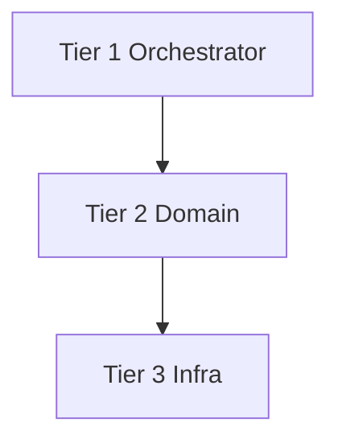

# Architecture

```mermaid
flowchart TD
    T1[Tier 1 Orchestrator] --> T2[Tier 2 Domain]
    T2 --> T3[Tier 3 Infra]
```

## Routing

| 태스크 | 모델 | 이유 |
|--------|------|------|
| planning | claude-opus-4 | 복잡한 추론 |
| execution | claude-haiku-4-5 | 속도 우선 |

## Memory

단기: Redis TTL 1h
장기: pgvector
