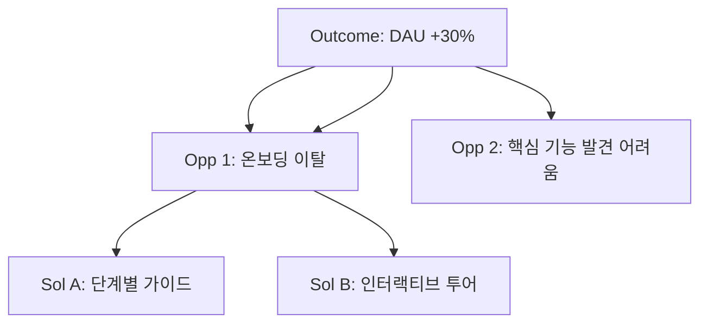

# Opportunity Solution Tree

```mermaid
flowchart TD
    O["Outcome: DAU +30%"]
    A["Opp 1: 온보딩 이탈"]
    B["Opp 2: 핵심 기능 발견 어려움"]
    S1["Sol A: 단계별 가이드"]
    S2["Sol B: 인터랙티브 투어"]
    O --> A --> S1
    O --> A --> S2
    O --> B
```

## Solution A — 단계별 가이드
status: running

## Solution B — 인터랙티브 투어
status: pending
